# claude-factory — the complete factory flow (code-accurate)

Source: `/home/user/claude-factory` @ `e25a598` (factory 0.19.0), `plugins/factory`. Every node below is taken from the code:
`cli/core/decision-table.js` (`route()`, `orderAction()`, `park()`, `deniedReroute()`), `cli/core/alignment.js` (the 6-row alignment vector),
`cli/core/steps.js` (`isDone`, `gateHash`, `gateDocs`, `combinedOf`), `cli/core/floors.js` + `policy/floors.json`, `recipes/*.json`,
`cli/core/clarify.js`, `cli/core/record.js`, `cli/core/wfargs.js`, `workflows/*.js`, `cli/core/loop.js`, `cli/core/human.js`,
`cli/core/drive.js`, `cli/core/env-repair.js`, `cli/core/environment.js`, `cli/core/probe.js`, `cli/core/plan.js`, `cli/core/tasks.js`,
`cli/core/reconcile.js`, `cli/core/verify.js`, `cli/core/review.js`, `cli/core/ship.js`, `cli/core/lifecycle.js`, `cli/core/amend.js`,
`hooks/*.js`, `policy/default-policy.json`.

Conventions in the diagrams: `[...]` a CLI step or record, `{...}` a decision in code, `([...])` start/end, hexagon-ish `{{...}}` a human gate,
`[/.../]` a human stop or reply, red nodes are parks. Policy keys are written `limits.max_review_rounds=5` (default value from `policy/default-policy.json`).

---

## Contents

0. [Diagram 0 — end-to-end main flow](#diagram-0--end-to-end-main-flow)
1. [Intake and recipe selection](#1-intake-and-recipe-selection)
2. [Clarify v3 in full](#2-clarify-v3-in-full)
3. [H1, deps, ground](#3-h1-deps-ground)
4. [Decide](#4-decide)
5. [Decompose](#5-decompose)
6. [Environment check and repair loop](#6-environment-check-and-repair-loop)
7. [Realize](#7-realize)
8. [Reconcile, prove, challenge](#8-reconcile-prove-challenge)
9. [Ship review, HS, ship, merge, CI, distill, close](#9-ship-review-hs-ship-merge-ci-distill-close)
10. [Loop engine and the park / resume / answer protocol](#10-loop-engine-and-the-park--resume--answer-protocol)
11. [Drive, hooks, human channels](#11-drive-hooks-human-channels)
12. [Amendment gate A and denial reroutes](#12-amendment-gate-a-and-denial-reroutes)
13. [Sequence: one standard@medium job](#13-sequence-one-standardmedium-job)
14. [Recipe matrix](#14-recipe-matrix)
15. [Where the code is ambiguous](#15-where-the-code-is-ambiguous)

---

## Diagram 0 — end-to-end main flow

The router (`factory next` = `decision-table.decide()` → `route()`) is re-entered after every step; this diagram flattens what it
chooses. Recipe branches are edge labels. The cross-cutting exits (park, deny, amendment, cancel) can happen at many points and are
drawn once at the bottom with every place they come from.

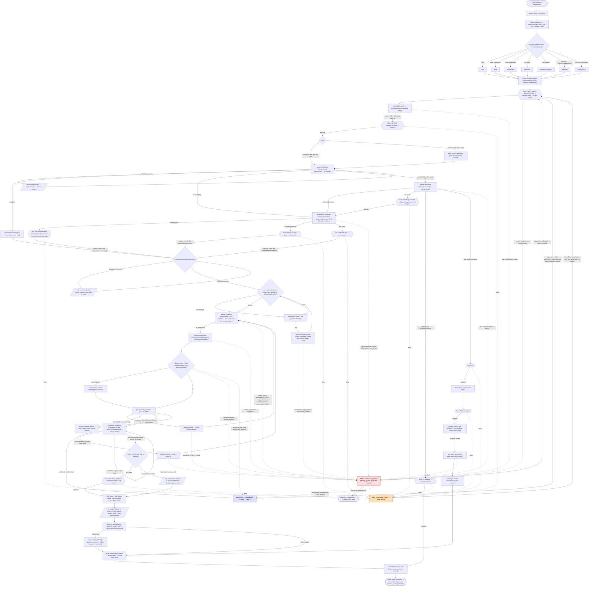
```mermaid
flowchart TD
  START(["User request or /factory:start"]) --> DOCTOR["factory doctor / factory init"]
  DOCTOR --> INTAKE["factory:intake skill → factory job new --title --type --risk --request [--epic]"]
  INTAKE --> SEL{"recipes/_selection.json, first matching rule"}
  SEL -->|"epic"| R_EPIC["epic"]
  SEL -->|"work_type spike"| R_SPIKE["spike"]
  SEL -->|"work_type hotfix"| R_HOT["hotfix@high"]
  SEL -->|"risk high"| R_FULL["full@high"]
  SEL -->|"risk medium"| R_STD["standard@medium"]
  SEL -->|"risk low + bug/docs/dependency"| R_BUG["bug@low"]
  SEL -->|"risk low, other types"| R_FEAT["feature@low"]
  R_EPIC & R_SPIKE & R_HOT & R_FULL & R_STD & R_BUG & R_FEAT --> LOCK["recipe.lock.json sealed, branch factory/J-nnnn, contract.md template"]
  LOCK --> ROUTER{{"factory next = route(): alignment vector → decision table → recipe order"}}

  ROUTER --> CLARIFY["clarify (skill:clarify → Workflow factory:clarify per stage)"]
  CLARIFY -->|"stage ready: ledger step clarify ok"| H1{{"Gate H1 / EH1: contract.md (hash = contract)"}}
  H1 -->|"approve"| AFTERH1{"recipe"}
  AFTERH1 -->|"bug@low, feature@low, epic"| GROUND
  AFTERH1 -->|"standard, full, hotfix, spike"| DEPS["deps: factory deps fetch (pinned dependency source)"]
  DEPS --> GROUND["ground: Workflow factory:ground (researchers + API ledger)"]
  GROUND -->|"blocking unknowns"| QSTOP[/"drive stop questions → user answers → factory answer"/]
  QSTOP --> GROUND
  GROUND -->|"bug@low"| PLANFC["decompose: factory plan from-contract (one task)"]
  GROUND -->|"feature@low"| DECOMP
  GROUND -->|"standard, full, hotfix, spike, epic"| DECIDE["decide: Workflow factory:fanout-judge --config decide"]
  DECIDE -->|"standard@medium"| DECOMP
  DECIDE -->|"full, hotfix"| H2{{"Gate H2: design record + critiques/design.json + api-ledger"}}
  DECIDE -->|"spike (mode recommendation)"| HF{{"Gate HF: findings + recommendation"}}
  DECIDE -->|"epic (mode contracts)"| EH2{{"Gate EH2"}}
  H2 -->|"approve"| DECOMP["decompose: Workflow factory:decompose (planner, plan probe, God Eye plan critique)"]
  HF -->|"approve"| CLOSE
  EH2 -->|"approve"| SLICES["decompose --mode slices (slicer)"]
  SLICES --> EH3{{"Gate EH3: slices.json"}}
  EH3 -->|"approve"| CHILDREN["children: factory epic spawn → each slice job runs its own recipe"]
  CHILDREN -->|"all slices closed"| EPICGATE["epic_gate: factory epic gate (end-to-end checks)"]
  EPICGATE --> CHAL_EPIC["challenge --mode conformance (epic-reviewer)"]
  CHAL_EPIC --> DISTILL

  DECOMP -->|"feature@low"| H3LOW{{"H3 auto: skipped when plan_critique approved and env needs no confirmation"}}
  DECOMP -->|"standard@medium"| H3STD{{"H3 combined: design + plan + environment"}}
  DECOMP -->|"full, hotfix"| H3HI{{"H3 combined: plan + environment"}}
  H3LOW & H3STD & H3HI -->|"approve (seals the proposed environment)"| ENVQ
  PLANFC --> ENVQ{"environment.needsConfirmation?"}
  ENVQ -->|"proposed / tampered"| ENVWAIT[/"wait env.unconfirmed: confirm environment HASH or none"/]
  ENVWAIT --> ENVQ
  ENVQ -->|"confirmed or none"| ENVCHK{"env-repair.routerAction: sealed env passed its check for this hash?"}
  ENVCHK -->|"no check yet"| ENVCHECK["factory env check --job (scratch worktree)"]
  ENVCHECK -->|"fail"| ENVREPAIR["env repair loop (fanout-judge --config env_repair → env check --repair → seal)"]
  ENVREPAIR --> ENVCHK
  ENVCHECK -->|"pass"| ENVCHK
  ENVCHK -->|"passed"| REALIZE["realize: Workflow factory:realize (DAG, builder → task verify, per-frontier integration)"]
  REALIZE -->|"all tasks done"| RECON["reconcile: Workflow factory:reconcile (integrator → factory reconcile run)"]
  RECON --> DRIFT{"alignment row 2: files outside allowed / into protected paths?"}
  DRIFT -->|"yes, first time"| REVERT["revertScope: commit restoring base versions"]
  REVERT --> PROVE
  DRIFT -->|"no"| PROVE["prove: factory verify run (CLI, no agent)"]
  PROVE -->|"commands/ACs failing, owners"| VFIX["verify-fix round → realize scope verifyFix"]
  VFIX --> REALIZE
  PROVE -->|"only doc/diff record missing"| EVID["factory evidence add AC --type doc|diff (drive or main session)"]
  EVID --> PROVE
  PROVE -->|"passed, or only human ACs missing"| CHAL["challenge: Workflow factory:fanout-judge --config challenge (lanes + finding-verifier)"]
  CHAL -->|"confirmed blocker/major, code level"| RFIX["review-fix round → realize scope fix"]
  RFIX --> REALIZE
  CHAL -->|"confirmed, level contract"| AMEND
  CHAL -->|"unverified only (re-verify loop)"| CHAL
  CHAL -->|"pass / unsettled findings left for the human"| SHIPQ{"recipe has HS and ship is not local?"}
  SHIPQ -->|"full, hotfix"| HS{{"Gate HS: report.md (hash = build fingerprint) + ship review"}}
  SHIPQ -->|"low / medium, or local"| SREV[/"ship review wait: confirm AC-n / accept|dismiss finding / approve ship"/]
  HS -->|"approve"| SHIP
  SREV --> SHIP["ship: factory ship (floors before_ship, manifest, push + PR or local)"]
  SHIP --> H4[/"H4 merge: GitHub → factory pr sync notices merge / local → user replies merged"/]
  H4 --> CIV["local merge: factory ci verify (ci_reverify floor) / GitHub: factory-gate check"]
  CIV -->|"hotfix@high"| PMC["post_merge_challenge (code + security) → follow-up job on confirmed"]
  CIV -->|"other recipes"| DISTILL
  PMC --> DISTILL["distill: factory distill context → lesson-writer → factory distill done"]
  DISTILL --> CLOSE["close: factory close (full floors, every step done, cleanup)"]
  CLOSE --> DONE(["done: digest of lessons + brief proposals (accept lesson Ln, accept brief Pn)"])

  %% cross-cutting exits
  PARK["PARK: state.status parked, pending_gate P, typed kind + question"]:::park
  REALIZE -.->|"needs_paths, dependency_conflict, task_exhausted, tasks_not_done, environment_broken"| PARK
  RECON -.->|"conflict, regression, integration"| PARK
  DRIFT -.->|"same files again: scope_violation"| PARK
  VFIX -.->|"loop stop: verify_fix_rounds"| PARK
  RFIX -.->|"loop stop: review_rounds"| PARK
  DECOMP -.->|"cap.decompose_rounds: plan_invalid / plan_probe"| PARK
  DECIDE -.->|"doc template streak 3: design"| PARK
  CLARIFY -.->|"agent failed twice: clarify"| PARK
  ENVREPAIR -.->|"environment_repair (seal) / environment_broken"| PARK
  EPICGATE -.->|"epic_gate"| PARK
  ROUTER -.->|"budget, no_progress (repeat guard)"| PARK
  PARK -->|"reply answers the park → resume + words"| ROUTER
  PARK -->|"cancel job / abandon job"| STOPPED(["cancelled / abandoned → router answers done"])

  DENY["deny REASON at a gate → state.denials"]:::deny
  H1 & H2 & HF & H3STD & H3HI & H3LOW & HS & EH2 & EH3 -.->|"deny"| DENY
  DENY -->|"deniedReroute: producer step runs again with the reason"| ROUTER

  AMEND["amend skill → amend start / submit → Gate A"]:::amend
  DRIFT -.->|"contract or plan hash drifted after approval"| AMEND
  PARK -.->|"amendment submitted pre-empts the park"| AMEND
  AMEND -->|"approve A: rebind approvals, reopen affected tasks, resume if parked"| ROUTER

  classDef park fill:#fdd,stroke:#c00,color:#000
  classDef deny fill:#ffe0b3,stroke:#c60,color:#000
  classDef amend fill:#e0e0ff,stroke:#33c,color:#000
```

### How `route()` decides (the order the code checks things)

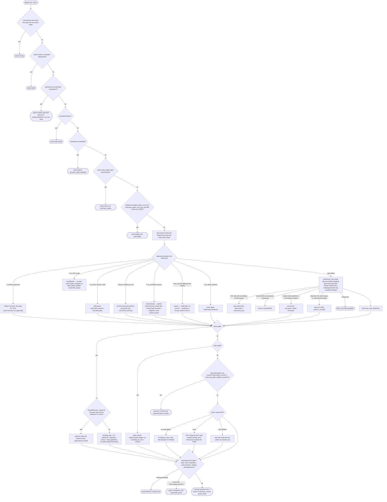
```mermaid
flowchart TD
  N(["factory next --job J"]) --> DRV{"a live factory drive owns this repo and I am not its child?"}
  DRV -->|"yes"| DRIVING(["action driving"])
  DRV -->|"no"| S1{"status closed / cancelled / abandoned?"}
  S1 -->|"yes"| DONE1(["action done"])
  S1 -->|"no"| S2{"parked and no submitted amendment?"}
  S2 -->|"yes"| PARKED(["action parked: park.kind, park.next, clarify.parkAdvice, env seal hash"])
  S2 -->|"no"| S3{"amendment open?"}
  S3 -->|"yes"| AMS(["action skill amend"])
  S3 -->|"no"| S4{"amendment submitted?"}
  S4 -->|"yes"| GA(["action gate A (resumes_park if parked)"])
  S4 -->|"no"| S5{"state.needs_replan (epic amendment)?"}
  S5 -->|"yes"| RP(["skill amend, rule row2.epic_replan"])
  S5 -->|"no"| S6{"budgets.exceeded: agent_runs over limits.max_agent_runs_per_job=400 or tree over 2000?"}
  S6 -->|"yes"| PB(["park budget, rule cap.budget"])
  S6 -->|"no"| FIXCLR["clear state.fix when the fingerprint moved and every task is done"]
  FIXCLR --> AL{"alignment.evaluate: first failing row"}
  AL -->|"1 contract_approved"| R1["clarify if not done, else gate H1 / EH1 (row1.contract_not_approved)"]
  AL -->|"2 no_drift: scope"| R2S["revertScope → re-route (row2.scope_reverted), or park scope_violation (row2.drift_scope)"]
  AL -->|"2 no_drift: contract / plan"| R2A["skill amend (row2.drift_contract / row2.drift_plan)"]
  AL -->|"3 floors_satisfied_so_far"| R3["run the missing pre-build or pre-merge step (row3.floor_missing)"]
  AL -->|"4 no_confirmed_serious"| R4["contract-level → amend (row4.contract_level), else review loop: fix round / diagnose / park review_rounds"]
  AL -->|"5 acs_proven (failing prove record)"| R5["owners → verify loop / no owners → evidence or human confirm (row5.*)"]
  AL -->|"6 no_stale_evidence"| R6["prove again (row6.stale_evidence)"]
  AL -->|"none failing"| ORD["orderAction: first recipe step not isDone (skipping prove that only lacks human checks and a challenge that left only unsettled findings)"]
  ORD -->|"HS / ship with something for the human"| SR["ship review (rule ship.review / ship.review_hs)"]
  ORD -->|"realize while env proposed / tampered"| EU["wait env.unconfirmed"]
  ORD -->|"realize while sealed env not checked / broken"| ER["env.check / env.repair_check / env.repair"]
  ORD -->|"step after H4, local merge, ci_reverify floor failing"| CI["factory ci verify (order.ci_reverify)"]
  ORD -->|"nothing left"| DONE2(["done, rule order.complete"])
  ORD --> NS["order.next_step: stepAction"]
  R1 & R2A & R3 & R4 & R5 & R6 & NS & ER & CI --> GATEQ{"action gate?"}
  GATEQ -->|"yes"| DEN{"deniedReroute: a denial of this gate hash with no producer run since?"}
  DEN -->|"yes"| PROD["producer step with denied.reason (gate.denied_revise)"]
  DEN -->|"no"| GV["pending_gate = id + gateHash + gateDocs, review = critics.gateView, H1 adds clarify.h1Summary"]
  GATEQ -->|"no"| CLQ{"skill clarify?"}
  CLQ -->|"yes"| CLI["action.clarify = clarify.nextInfo (stage, run or waiting_for_user + screen)"]
  CLQ -->|"no"| DCAP{"step decompose and counters.decompose_rounds >= limits.max_plan_validate_rounds=3?"}
  DCAP -->|"yes"| PPI(["park plan_invalid, rule cap.decompose_rounds"])
  DCAP -->|"no"| MERGEQ{"action merge (H4)?"}
  MERGEQ -->|"pr.mode github"| PRS["cli factory pr sync, then wait (merge it on GitHub)"]
  MERGEQ -->|"local"| LM["wait: merge yourself, reply merged (merge_seen when base contains the head)"]
  MERGEQ -->|"step children"| CH["wait with ready slice ids (drive runs factory use)"]
  PROD & GV & CLI & PRS & LM & CH & MERGEQ --> REP{"repeat guard (not gate / wait): same repeatKey + same decision, nothing attempted since?"}
  REP -->|"nothing attempted"| RQ(["same decision, requery true"])
  REP -->|"count over limits.repeat_guard=2"| PNP(["park no_progress, rule cap.repeat_guard"])
  REP -->|"ok"| REC(["record(): decision row J-Dnnnn in decisions, returns action JSON"])
```

---

## 1. Intake and recipe selection

```mermaid
flowchart TD
  U(["/factory:start ARGS or a request in chat"]) --> SS["SessionStart hook: Current job J · recipe · risk · status · waiting at gate"]
  SS --> START["skill factory:start"]
  START --> DOC["factory doctor"]
  DOC -->|"not initialized"| INIT["factory init: .factory/ kept out of git, commit-msg hook adds Factory-Job trailers"]
  DOC -->|"errors: no commits, no git identity"| STOPD(["tell the user how to fix, stop"])
  INIT --> NEWQ
  DOC -->|"ok"| NEWQ{"a request and no active job covers it?"}
  NEWQ -->|"no: continue"| DRIVE(["factory drive"])
  NEWQ -->|"yes"| IN["skill factory:intake"]
  IN --> I1["1 read repo quickly: layout, README, touched files, tests, CODEOWNERS, CI"]
  I1 --> I2["2 classify work type: feature bug hotfix refactor migration dependency docs spike greenfield"]
  I2 --> I3["3 propose risk low / medium / high with one-line reasons"]
  I3 --> I4["4 job or epic: more than one PR or subsystem, migration plus consumers, public API plus callers, staged rollout, over ~3 days"]
  I4 --> I5["5 one-line intent restatement (no separate confirmation: clarify's read-back shows it)"]
  I5 --> JN["factory job new --title --type --risk --request 'verbatim words' [--epic]"]
  JN --> V1{"work_type in policy.work_types and risk in low/medium/high?"}
  V1 -->|"no"| F1(["fail bad_input"])
  V1 -->|"yes"| EFF["effectiveRisk: policy.risk_floor hotfix=high, migration=high (risk_raised_by_policy)"]
  EFF --> DEP{"parent given and parent already a child?"}
  DEP -->|"yes"| F2(["fail depth_cap (limits.max_tree_depth=2)"])
  DEP -->|"no"| RS["recipes.select over _selection.json rules"]
  RS --> RR1{"epic true?"}
  RR1 -->|"yes"| E["epic"]
  RR1 -->|"no"| RR2{"work_type spike?"}
  RR2 -->|"yes"| SP["spike"]
  RR2 -->|"no"| RR3{"work_type hotfix?"}
  RR3 -->|"yes"| HF["hotfix@high"]
  RR3 -->|"no"| RR4{"effective risk"}
  RR4 -->|"high"| FH["full@high"]
  RR4 -->|"medium"| SM["standard@medium"]
  RR4 -->|"low and bug / docs / dependency"| BL["bug@low"]
  RR4 -->|"low, any other type"| FL["feature@low"]
  E & SP & HF & FH & SM & BL & FL --> PROVEN{"risk high and recipe.status not proven?"}
  PROVEN -->|"yes"| F3(["fail floor: high risk runs proven recipes only"])
  PROVEN -->|"no"| CREATE["base = policy.base_branch or project base or current branch; base_commit = rev-parse"]
  CREATE --> BR["git branch factory/J-nnnn at base_commit (not for an epic)"]
  BR --> FILES["jobs/J/contract.md (template), jobs/J/recipe.lock.json (sealed rulebook snapshot: recipe, policy, risk)"]
  FILES --> ST["state.json: status active, approvals {}, denials [], counters, design_templates adr@2/no-adr@2, policy snapshot"]
  ST --> CUR["setCurrent J; parent.children += J; project-brief.refresh (.factory/project.md)"]
  CUR --> TELL["tell the user: job id, type, risk, recipe; write Intent (Problem, Who, Outcome) into contract.md"]
  TELL --> DRIVE
  DRIVE --> LOCKQ{"steps.lockedRecipe: recipe.lock.json seal valid, same id / version, recipe passes checks?"}
  LOCKQ -->|"no"| F4(["fail recipe_lock_invalid: restore the file or factory reseal (human-only, terminal)"])
  LOCKQ -->|"yes / no lock (legacy: current recipe file)"| ROUTE(["route()"])
```

---

## 2. Clarify v3 in full

Record: `jobs/J/clarify.json` (sealed, version 3). Stages: `readback, readback_wait, research, sheet_wait, interpret, redirect,
redirect_wait, assemble, check, dispute, diagnose, ready`. Waits: `readback_wait, sheet_wait, redirect_wait`. Agents (from
`config/workflows/clarify.json`): interviewer (readback, redirect, interpret), researcher repo + docs and brief-writer (research),
contract-writer (assemble), god-eye (check, diagnose), finding-verifier (dispute). Each running stage is one run of
`factory wfargs clarify` → Workflow `factory:clarify` → `factory record` → `clarify.record()` → `finish()`.

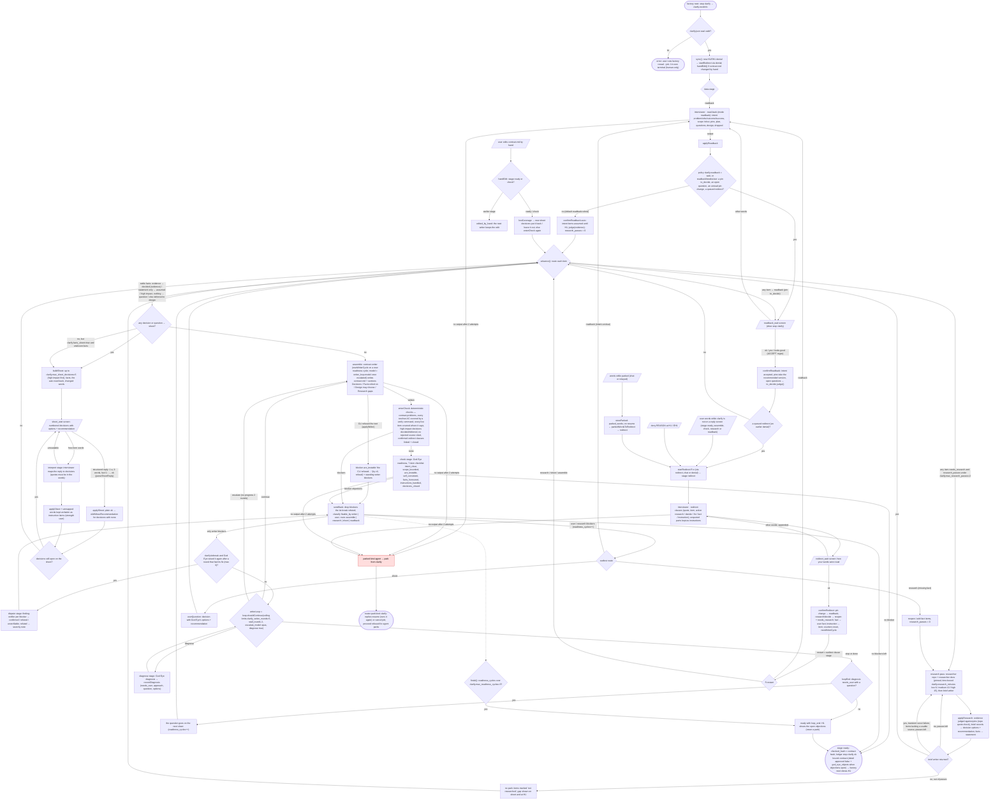
```mermaid
flowchart TD
  NX(["factory next: step clarify → clarify.nextInfo"]) --> TAMP{"clarify.json seal valid?"}
  TAMP -->|"no"| TERR(["error: user runs factory reseal --job J in own terminal (human-only)"])
  TAMP -->|"yes"| SYNC["sync(): new H1/EH1 denial → startRedirect via denial; handEdit() if contract.md changed by hand"]
  SYNC --> STG{"data.stage"}

  %% ---------------- read-back
  STG -->|"readback"| RB["interviewer · read-back (mode readback): intent problem/who/outcome/success, scope in/out, pins, plan, questions, design, dropped"]
  RB -->|"no output after 2 attempts"| AGF["parked kind agent → park from clarify"]:::park
  RB -->|"output"| APRB["applyReadback"]
  APRB --> RBW{"policy clarify.readback = wait, or readbackNeedsUser: a pin to_decide, an open question, an unread pin change, a queued redirect?"}
  RBW -->|"no (default readback=show)"| AUTO["confirmReadback auto: intent items assumed until H1; judge(evidence); research_passes = 0"]
  AUTO --> ROUTE
  RBW -->|"yes"| RBWAIT[/"readback_wait screen (drive stop clarify)"/]
  RBWAIT -->|"ok / yes / looks good (ACCEPT regex)"| RBOK["confirmReadback: intent accepted, pins take the recommended version, open questions → to_decide; judge()"]
  RBOK --> QR{"a queued redirect (an earlier denial)?"}
  QR -->|"yes"| REDIR
  QR -->|"no"| ROUTE
  RBWAIT -->|"other words"| RB

  %% ---------------- routing
  ROUTE{"advance(): route each item"}
  ROUTE -->|"any item → readback (pin to_decide)"| RBWAIT
  ROUTE -->|"any item needs_research and research_passes under clarify.max_research_passes=2"| RES
  ROUTE -->|"settle facts: evidence → decided (evidence) / statement only → assumed / high impact, nothing → question / else deferred to design"| SHQ{"any decision or question → sheet?"}
  SHQ -->|"yes"| SHEET["buildSheet: up to clarify.max_sheet_decisions=5 (high impact first), facts, the auto read-back, changed words"]
  SHQ -->|"no, but clarify.facts_sheet=true and unshown facts"| SHEET
  SHQ -->|"no"| ASM
  SHEET --> SHW[/"sheet_wait screen: numbered decisions with options + recommendation"/]

  %% ---------------- research
  RES["research pass: researcher repo + researcher docs (pinned, time-boxed clarify.research_minutes low 6 / medium 10 / high 15), then brief-writer"]
  RES --> APRS["applyResearch: evidence judged against pins (repo quote check), brief records → decision options + recommendation, facts → statement"]
  APRS --> RSQ{"brief writer returned?"}
  RSQ -->|"no, passes left"| RES
  RSQ -->|"no, out of passes"| GAP["no park: items marked 'not researched', gap shown on sheet and at H1"]
  GAP --> ROUTE
  RSQ -->|"yes, transient scout failure, items lacking a usable source, passes left"| RES
  RSQ -->|"yes"| ROUTE

  %% ---------------- sheet
  SHW -->|"structured reply: 1 a, 2: words, fact 1: …, ok (parseSheetReply)"| APS["applySheet; plain ok → okWithoutRecommendation for decisions with none"]
  SHW -->|"free-form words"| INTP["interpret stage: interviewer maps the reply to decisions (quotes must be in the words)"]
  INTP -->|"unreadable"| SHW
  INTP --> APS2["applySheet + unmapped words kept verbatim as instruction items (strength user)"]
  APS & APS2 --> OPEN{"decisions still open on the sheet?"}
  OPEN -->|"yes"| SHW
  OPEN -->|"no"| ROUTE

  %% ---------------- assemble + check
  ASM["assemble: contract-writer (newWriterCycle on a new readiness cycle; model = writer_loop.model once escalated) writes contract.md + sections Decisions / Facts relied on / Design may choose / Research gaps"]
  ASM -->|"no output after 2 attempts"| AGF
  ASM -->|"CLI refused the text (applyWriter)"| REFUSE["blocker acs_testable 'the CLI refused…' (by cli, refusal) + standing writer blockers"]
  REFUSE --> SB
  ASM -->|"written"| DET["enterCheck: deterministic checks — contract.problems, every test/run AC covered by a verify command, every live item covered where it says, high-impact decisions decided/deferred, no rejected source cited, confirmed redirect clauses linked + closed"]
  DET -->|"blockers"| SB
  DET -->|"none"| GE["check stage: God Eye readiness, 7-item checklist: intent_clear, scope_bounded, acs_testable, self_consistent, facts_honoured, instructions_handled, decisions_closed"]
  GE -->|"no output after 2 attempts"| AGF
  GE -->|"no blocker"| READY
  GE -->|"blocker objections"| SB

  %% ---------------- send back
  SB["sendBack: drop blockers the tie-break refuted; classify fixable_by writer | user; route assemble | research | sheet | readback"]
  SB -->|"no blockers left"| READY
  SB -->|"only writer blockers"| DISPQ{"clarify.tiebreak and God Eye raised it again after a round that had its fix (max 3)?"}
  DISPQ -->|"yes"| DISP["dispute stage: finding-verifier per blocker → confirmed / refuted / unverifiable; refuted → severity note"]
  DISP --> SB
  DISPQ -->|"no"| WL{"writerLoop = loop.shouldContinue(ceiling limits.clarify_writer_rounds=5, stall_rounds 2, escalate_model opus, diagnose true)"}
  WL -->|"continue"| ASM
  WL -->|"escalate (no progress 2 rounds)"| ASM
  WL -->|"diagnose"| DIAG["diagnose stage: God Eye diagnosis → recordDiagnosis (needs_user, approach, question, options)"]
  DIAG --> WL
  WL -->|"stop or done"| LEND{"loopEnd: diagnosis needs_user with a question?"}
  LEND -->|"yes"| UQ["the question goes on the next sheet (readiness_cycles++)"]
  UQ --> ROUTE
  LEND -->|"no"| READYO["ready with loop_end: H1 shows the open objections (never a park)"]
  SB -->|"user / research blockers (readiness_cycles++)"| EARL{"earliest route"}
  EARL -->|"readback (intent unclear)"| RB
  EARL -->|"research (missing fact)"| RRES["reopen / add fact items, research_passes = 0"]
  RRES --> RES
  EARL -->|"sheet"| UQ2["userQuestion: decision with God Eye's options + recommendation"]
  UQ2 --> ROUTE

  CAP{"finish(): readiness_cycles over clarify.max_readiness_cycles=3?"}
  SB -.-> CAP
  CAP -->|"yes"| READYO
  READYO --> READY
  READY(["stage ready: checked_hash = contract hash; ledger step clarify ok bound contract (detail approved false + god_eye_objects when objections open) → factory next shows H1"])

  %% ---------------- redirects
  WORDS[/"user words while clarify is not on a reply screen (stage ready, assemble, check, research or readback)"/] --> REDIR["startRedirect R-n (via redirect, chat or denial) → stage redirect"]
  H1DENY[/"deny REASON at H1 / EH1"/] --> REDIR
  REDIR --> RDI["interviewer · redirect: clauses (quote, item, action research / decide / fix / fact / instruction); unquoted parts kept as instructions"]
  RDI -->|"no output after 2 attempts"| AGF
  RDI --> RDW[/"redirect_wait screen: how your words were read"/]
  RDW -->|"other words: appended"| RDI
  RDW -->|"ok"| RCONF["confirmRedirect: pin change → readback; research/decide → reopen + needs_research; fact → user fact; instruction → item; counters reset, newWriterCycle"]
  RCONF -->|"restart = earliest clause stage"| RESTART{"R.restart"}
  RESTART -->|"readback"| RB
  RESTART -->|"research / sheet / assemble"| ROUTE

  %% ---------------- hand edits and parks
  HAND[/"user edits contract.md by hand"/] --> HE{"handEdit: stage ready or check?"}
  HE -->|"earlier stage"| KEEP["edited_by_hand: the next writer keeps the edit"]
  HE -->|"ready / check"| LOST["lostCoverage → new sheet decisions put it back / leave it out; else enterCheck again"]
  LOST --> ROUTE
  AGF --> PARKC(["router park kind clarify: replies resume (runs it again) or cancel job; proceed refused for agent parks"])
  PWORDS[/"words while parked (chat or relayed)"/] --> STP["storeParked: parked_words; on resume → parkedWordsToRedirect → redirect"]
  STP --> REDIR

  classDef park fill:#fdd,stroke:#c00,color:#000
```

Replies during clarify: the UserPromptSubmit hook applies an unmistakable reply itself (`clarify.chatReply`: `ok` on a read-back or
redirect screen, a structured sheet answer); anything else the main session records verbatim with `factory clarify reply "…"`
(or `factory clarify redirect "…"`). Both are the main session's relay only (the guard refuses them from a subagent).

---

## 3. H1, deps, ground

```mermaid
flowchart TD
  CR(["clarify ready"]) --> H1G["route: row1 → gate H1 (EH1 for an epic): pending_gate {id H1, hash = b.contract, docs [contract.md]}"]
  H1G --> VIEW["gate view: clarify.h1Summary (words checked, decisions and who made them, gaps, drops, God Eye objections, loop_end) + critics.gateView + environment notice"]
  VIEW --> STOPG[/"drive stop gate → factory:gate skill shows it"/]
  STOPG -->|"approve (chat or terminal + code)"| APQ{"human.approve: a presented gate, current hash = pending hash?"}
  APQ -->|"no"| STALE(["fail stale_gate: present it again"])
  APQ -->|"yes"| APH1["approvals.H1 = {hash, at, via, snapshot copy in approved/}"]
  STOPG -->|"deny REASON (reason required)"| DN["denials += {gate H1, hash, reason}"]
  DN --> RR["deniedReroute → clarify (skill) → sync() turns the denial into redirect R-n → read back → restart"]
  APH1 --> NEXT{"recipe has deps?"}
  NEXT -->|"standard, full, hotfix, spike"| DEPS["factory deps fetch --job J (CLI step, agents refused)"]
  NEXT -->|"bug@low, feature@low, epic"| GR
  DEPS --> DPOL{"policy deps.enabled=true?"}
  DPOL -->|"no"| DSKIP["recorded as nothing to fetch"]
  DPOL -->|"yes"| DF["wanted(): pins from clarify + repo manifests → fetch read-only into .factory/deps (deps.max_packages=20, max_archive_mb=100, max_unpacked_mb=200, timeout_seconds=180); failures recorded as gaps"]
  DF --> DREC["ledger step deps ok bound contract (once per contract)"]
  DSKIP --> DREC
  DREC --> GR["wfargs ground: probes codebase / interfaces / history / external (hotfix mode: failing path / blast radius), max limits.max_parallel_research=4"]
  GR --> GW["Workflow factory:ground: researchers in parallel, retry a failed probe once"]
  GW --> LED["interfaces probe writes API ledger entries (symbol, file, line, exact quote, version, behaviour), checks them with factory deps check --file -; any probe may name deps it needs"]
  LED --> REC["factory record → recGround"]
  REC --> FETCH["probe-requested packages fetched now (deps.fetch add)"]
  FETCH --> CHK{"checkLedger: quotes match the fetched file at that line and version? source newly arrived?"}
  CHK -->|"rejected or arrived, no re-ask yet"| REASK["ground.reask.json → status retry: ground runs ONCE more for those probes only, with the CLI's reasons"]
  REASK --> GR
  CHK -->|"ok / re-ask used"| WL["api-ledger written: verified L-n entries, rejected kept as rejected, gaps"]
  WL --> FM["findings.md (topics, claims with sources, UNVERIFIED), project-brief.noteGround"]
  FM --> BLK{"blocking unknowns not answered?"}
  BLK -->|"yes"| NU["ledger ground ok false + status needs_user"]
  NU --> QS[/"drive stop questions: numbered list"/]
  QS --> ANS["main session: factory answer --question … --answer … (user relay, main session only)"]
  ANS --> GR
  BLK -->|"no"| OK(["ledger step ground ok bound contract → next recipe step"])
```

---

## 4. Decide

`workflow:fanout-judge --config decide`. Config `config/workflows/decide.json`; brief from `wfargs.decide()`; loop inside
`workflows/fanout-judge.js`; recorded by `record.recDecide()`.

```mermaid
flowchart TD
  IN(["route: step decide (threat_model: true full/hotfix · false spike · 'policy' = risk high for standard/epic)"]) --> BRIEF["wfargs decide: job context + findings + clarify deferred items + deps briefText + API ledger + prior design, doc problems, last critique"]
  BRIEF --> DQ{"a denial of H2 / EH2 / HF / combined H3 (denyTarget decide) after the last decide, a prior design exists, mode not recommendation?"}
  DQ -->|"yes and critics.denyMode = targeted (no rethink words)"| TGT["targeted: NO option generators; architect revises the denied design (prior_design) with the denial"]
  DQ -->|"no, or rethink / different approach / start over"| FAN["fan-out in parallel, each retried once: option-generator O-1 smallest change · O-2 most robust for two years · O-3 closest to repo patterns · threat-modeler (when threat model, not in recommendation mode)"]
  FAN --> ARCH["architect decides: ADR adr-001-*.md (template adr@2) or no-adr.md, recommendation.md (spike), contracts.md + contracts.json (epic)"]
  TGT --> CRIT
  ARCH -->|"nothing twice"| ERR(["envelope error → ledger error; router retries the step (see ambiguity 1)"])
  ARCH --> CRIT["critique round r: God Eye (design + depth checklist) ∥ api-conformance (only when deps source or ledger, not recommendation)"]
  CRIT --> EVQ["an API item with severity blocker/major but no evidence.ref → minor (evidence_rejected)"]
  EVQ --> VER["finding-verifier per serious item (fan, retry once); no result → unverifiable"]
  VER --> OPENQ{"open = serious items not refuted; any critic missing?"}
  OPENQ -->|"none open, none missing"| APPR["stop approved"]
  OPENQ -->|"none open, a critic missing"| CF["stop critic_failed"]
  OPENQ -->|"open items"| LS["loopStep: shouldContinue(policy stall_rounds 1, escalate_model loops.escalate_model=opus via wfargs.loopModel, diagnose, ceiling = max-1, max = max(limits.max_design_critique_rounds=3, 3))"]
  LS -->|"diagnose"| DG["God Eye diagnosis of the design loop → recordDiagnosis → shouldContinue again"]
  DG --> REV
  LS --> REV["architect revises (ALWAYS once after a round with open items; on the escalated model; with the diagnosis approach)"]
  REV --> STQ{"loop stop, or round >= max?"}
  STQ -->|"no"| CRIT
  STQ -->|"yes"| STOPQ["stop ceiling / no_progress + question: approve with objections · deny naming the defect (targeted revise) · deny rethink"]
  APPR & CF & STOPQ --> ENV["envelope ok: options, judge, critiques[], stop, revised_after_last, question, loop"]
  ENV --> RD["factory record → recDecide"]
  RD --> RD1{"architect paths inside jobs/J? threat-model.md exists when required?"}
  RD1 -->|"no"| MA(["fail missing_artifact"])
  RD1 -->|"yes"| RD2["decide_rounds++, options.json (O-n), source-cited serious items: quote checked against fetched deps (mismatch → minor, not open)"]
  RD2 --> RD3["critiques/design.json sealed {hash = design, verdict, items, rounds, stop, open, question}"]
  RD3 --> DOC{"doc.designProblems: template checks (front matter, sections in order, AC table, mermaid architecture + sequenceDiagram with alt/opt, Decision records D-n with options table + one chosen, Data model and mapping, Failure and state flow, Project layout tree, How it runs); no-adr refused when options materially differ or medium/high risk with an external system"}
  DOC -->|"problems, streak under 3 (DOC_RETRY_CAP)"| RETRY["ledger decide ok false + doc_problems → status retry: architect gets the problems"]
  RETRY --> BRIEF
  DOC -->|"problems 3 runs in a row"| PD(["park design (from fanout-judge)"]):::park
  DOC -->|"clean"| OKQ{"approved, or stopped (ceiling / no_progress / critic_failed), or rounds >= max with a human gate that sees the design, or no design gate in the recipe?"}
  OKQ -->|"no"| PD2(["park design: critique did not approve and no human gate will review it"]):::park
  OKQ -->|"yes"| LOK(["ledger step decide ok bound contract + design"])
  LOK --> NXT{"recipe"}
  NXT -->|"full, hotfix"| H2{{"H2: hash = b.design; docs: design files, critiques/design.json, api-ledger"}}
  NXT -->|"standard@medium"| COMB["no gate now: the design is approved inside combined H3 (design + plan + environment)"]
  NXT -->|"spike"| HF{{"HF: hash = sha256(findings:design); docs findings.md + recommendation"}}
  NXT -->|"epic"| EH2{{"EH2"}}
  H2 & HF & EH2 -->|"deny REASON"| DEN["deniedReroute → decide again with the reason (targeted or rethink by critics.denyMode)"]
  DEN --> BRIEF
  FLOOR["floor design_critique: verdict approve, OR (rounds at max or stop in ceiling/no_progress/critic_failed) AND the human approved the design at H2 or in H3.design"]

  classDef park fill:#fdd,stroke:#c00,color:#000
```

---

## 5. Decompose

```mermaid
flowchart TD
  IN(["route: step decompose"]) --> R0{"recipe step run"}
  R0 -->|"bug@low: cli:plan from-contract"| FC["factory plan from-contract --job J: one task from the contract (no probe, no critique, no plan gate)"]
  FC --> ENVQ(["→ environment confirmation before realize (diagram 6)"])
  R0 -->|"epic: workflow decompose --mode slices"| SL["slicer writes slices.json (S00 freezes contracts + flag, every E-AC owned) → validateSlices"]
  SL --> EH3{{"EH3"}}
  R0 -->|"workflow:decompose"| CAP{"counters.decompose_rounds >= limits.max_plan_validate_rounds=3?"}
  CAP -->|"yes"| PPI(["park plan_invalid (cap.decompose_rounds)"]):::park
  CAP -->|"no"| PH{"wfargs.decomposePhase"}
  PH -->|"null: probe off (decompose.plan_probe false, probe_override false, step plan_probe false)"| ONE["planner rounds + cold God Eye plan critique (2 rounds, planner revises) in one workflow run"]
  PH -->|"plan: no plan / invalid / probe failed and probe loop not stopped / a critique of this plan exists"| PLAN
  PH -->|"probe: valid plan, no probe record"| PROBE
  PH -->|"critique: valid, probed, no critique of this plan, critique loop not stopped"| CRIT

  PLAN["Workflow factory:decompose phase plan: planner (model escalated when probe/plan_critique loop level >= 1) — rounds = max_plan_validate_rounds - decompose_rounds; each round the planner runs factory plan validate"]
  PLAN --> PW["planner writes plan.json (tasks: id, objective, allowed_paths, depends_on, criteria_ids, verify_commands {cmd, covers}, retry_limit, rollback, bootstrap; interfaces + consumes) and environment.proposed.json when needed; carries accepted lessons"]
  ONE --> PW
  PW --> REC["factory record → recDecompose"]
  REC --> VAL{"plan.validate: schema · unique ids · known deps · ACs exist · no protected paths · non-empty verify cmds · interfaces owned and in owner's paths · one bootstrap, first · consumes declared · every AC covered · design Project layout: each new/changed/deleted file owned by exactly one task, each path covers a layout file · low risk at most 6 tasks · no path overlap with another job's plan lock · no cycle → waves · environment.proposed.json valid"}
  VAL -->|"invalid"| INV["decompose_rounds++, ledger decompose ok false + errors → status retry (planner gets the errors)"]
  INV --> CAP
  VAL -->|"valid"| PDEPS["packages the planner adds: deps.fetch"]
  PDEPS --> PON{"probe on and phase not critique?"}
  PON -->|"no probe record"| PP["status retry probe_pending → router: step plan_probe"]
  PP --> PROBE
  PROBE["factory plan probe --job J (CLI long step: detached child, bounded by FACTORY_DRIVE_DEADLINE; drive may yield)"]
  PROBE --> MODE{"probe.mode: policy decompose.plan_probe auto (default) / lint / full / false; probe_override"}
  MODE -->|"auto + gate env is a proposal whose setup installs from the network"| LINT["lint only: fixed_port, sleep, background; setup not_run"]
  MODE -->|"full, or auto otherwise"| FULL["lint + scratch worktree of base commit: env setup (proposed → confirmed → repo proposal), dry-run each verify cmd (limits.probe_command_seconds=120, probe_timeout_seconds=900, allowlisted env, proxy vars); must fail for the right reason; greenfield waits for the bootstrap task"]
  LINT & FULL --> PREC["probe.json sealed (bound plan + env hashes) → record.probeRecorded: loop probe (ceiling 3, stall 1, no diagnose, escalate if models on)"]
  PROBE -->|"interrupted twice"| PPK(["park plan_probe: a lint only · b run it in your own terminal then resume · c no probe for this job"]):::park
  PREC --> PRQ{"probe ok?"}
  PRQ -->|"problems and loop level under 3"| PRET["status retry: planner gets the probe's output"]
  PRET --> PLAN
  PRQ -->|"ok, or loop stopped (problems shown at the gate, never a park)"| CPQ{"critique of this plan exists?"}
  CPQ -->|"no and critique loop not stopped"| CPEND["status retry critique_pending"]
  CPEND --> CRIT
  CRIT["Workflow decompose phase critique: God Eye plan critique once, with the probe record as INPUTS"]
  CRIT --> REC2["record: critiques/plan.json sealed {hash = plan, verdict, items, probe}; approve → ledger plan_critique ok"]
  REC2 -->|"revise: serious items, plan_critique loop (ceiling 2) not stopped"| PLAN
  REC2 -->|"approve, or loop stopped"| OK
  CPQ -->|"yes"| OK["ledger step decompose ok bound plan (+ design under a combined gate) + probe detail; loops probe / plan_critique cleared"]
  OK --> GATE{"recipe gate"}
  GATE -->|"feature@low: H3 auto plan_critique, combined plan + environment"| AUTOQ{"plan_critique ok for this plan AND environment.needsConfirmation false?"}
  AUTOQ -->|"yes"| SKIPH3(["H3 counts as done: no human gate"])
  AUTOQ -->|"no"| H3
  GATE -->|"standard: combined design + plan + environment"| H3
  GATE -->|"full / hotfix: combined plan + environment"| H3
  H3{{"Gate H3: hash = sha256({design, plan, environment hash}); docs: design files + critiques/design.json + api-ledger (when design), plan.json, critiques/plan.json, probe.json, environment.proposed.json; review: layout tree with task owners, critic objections, probe"}}
  H3 -->|"approve"| APQ{"environment part tampered?"}
  APQ -->|"yes"| TAMP(["fail environment_tampered"])
  APQ -->|"no"| SEAL["approvals.H3 = {hash, combined, design, plan, environment}; env proposed → environment.confirm → .factory/environment.json sealed (event environment_set)"]
  SEAL --> REAL(["→ env check, realize"])
  H3 -->|"deny REASON"| DT{"combined includes design? critics.denyTarget(reason)"}
  DT -->|"rethink words, or design/api words"| DEC(["decide again"])
  DT -->|"plan/task/verify/env words and no design words; or no design in the gate"| PLAN

  ENVP["environment proposal sources (gateProposal): jobs/J/environment.proposed.json (planner) → confirmed if same hash as .factory/environment.json; none; else repo detection (environment.detect)"]

  classDef park fill:#fdd,stroke:#c00,color:#000
```

---

## 6. Environment check and repair loop

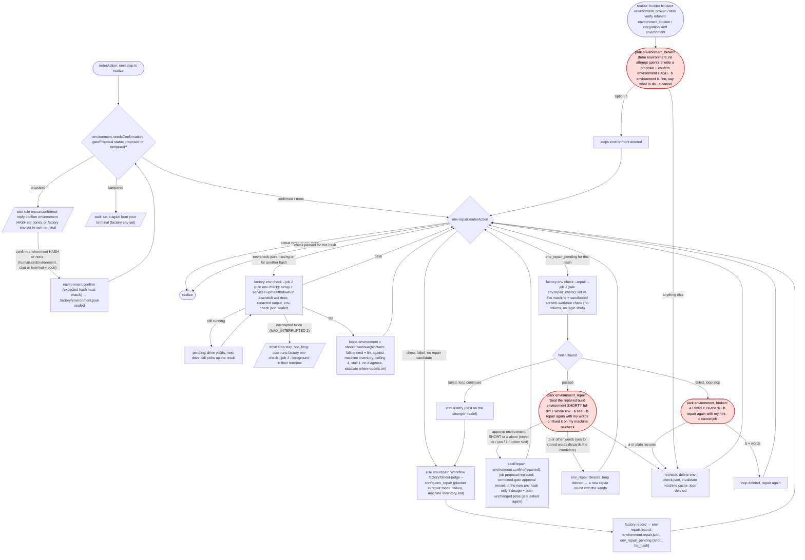
```mermaid
flowchart TD
  IN(["orderAction: next step is realize"]) --> NC{"environment.needsConfirmation: gateProposal status proposed or tampered?"}
  NC -->|"proposed"| WAIT[/"wait rule env.unconfirmed: reply confirm environment HASH (or none), or factory env set in own terminal"/]
  NC -->|"tampered"| WAITT[/"wait: set it again from your terminal (factory env set)"/]
  WAIT -->|"confirm environment HASH or none (human.setEnvironment, chat or terminal + code)"| CONF["environment.confirm (expected hash must match) → .factory/environment.json sealed"]
  CONF --> NC
  NC -->|"confirmed / none"| RA{"env-repair.routerAction"}
  RA -->|"status none or env none"| GO(["realize"])
  RA -->|"env-check.json missing or for another hash"| CHK["factory env check --job J (rule env.check): setup + services up/health/down in a scratch worktree, redacted output, env-check.json sealed"]
  CHK -->|"still running"| PEND["pending: drive yields; next drive call picks up the result"]
  PEND --> CHK
  CHK -->|"interrupted twice (MAX_INTERRUPTED 2)"| TOOLONG[/"drive stop step_too_long: user runs factory env check --job J --foreground in their terminal"/]
  CHK -->|"pass"| RA
  RA -->|"check passed for this hash"| GO
  CHK -->|"fail"| LOOP["loops.environment = shouldContinue(blockers: failing cmd + lint against machine inventory; ceiling 4, stall 1, no diagnose, escalate when models on)"]
  LOOP --> RA
  RA -->|"check failed, no repair candidate"| REP["rule env.repair: Workflow factory:fanout-judge --config env_repair (planner in repair mode: failure, machine inventory, lint)"]
  REP --> RREC["factory record → env-repair.record: environment.repair.json, env_repair_pending {short, for_hash}"]
  RREC --> RA
  RA -->|"env_repair_pending for this hash"| RCHK["factory env check --repair --job J (rule env.repair_check): lint vs this machine + sandboxed scratch-worktree check (no tokens, no login shell)"]
  RCHK --> FR{"finishRound"}
  FR -->|"passed"| SEALQ(["park environment_repair: 'Seal the repaired build environment SHORT?' full diff + whole env · a seal · b repair again with my words · c I fixed it on my machine: re-check"]):::park
  FR -->|"failed, loop continues"| RETRY["status retry (next on the stronger model)"]
  RETRY --> REP
  FR -->|"failed, loop stop"| BROKEN(["park environment_broken: a I fixed it, re-check · b repair again with my hint · c cancel job"]):::park
  SEALQ -->|"approve environment SHORT or a alone (never ok / yes / 1 / option text)"| SEAL["sealRepair: environment.confirm(repaired), job proposal replaced; combined-gate approval moves to the new env hash only if design + plan unchanged (else gate asked again)"]
  SEAL --> RA
  SEALQ -->|"b or other words (yes to stored words discards the candidate)"| AGAIN["env_repair cleared, loop deleted → a new repair round with the words"]
  AGAIN --> RA
  SEALQ -->|"c"| RECHECK["recheck: delete env-check.json, invalidate machine cache, loop deleted"]
  RECHECK --> RA
  BROKEN -->|"a or plain resume"| RECHECK
  BROKEN -->|"b + words"| AGAIN2["loop deleted, repair again"]
  AGAIN2 --> RA
  BUILDER(["realize: builder blocked environment_broken / task verify refused environment_broken / integration kind environment"]) --> PEB(["park environment_broken (from environment, no attempt spent): a write a proposal + confirm environment HASH · b environment is fine, say what to do · c cancel"]):::park
  PEB -->|"option b"| B2["loops.environment deleted"]
  PEB -->|"anything else"| RECHECK
  B2 --> RA

  classDef park fill:#fdd,stroke:#c00,color:#000
```

---

## 7. Realize

### 7a. Router side and the workflow's DAG scheduler

```mermaid
flowchart TD
  IN(["route: step realize"]) --> SCOPE{"action.scope"}
  SCOPE -->|"state.fix.kind fix"| SF["fix (review-fix round)"]
  SCOPE -->|"state.fix.kind verifyFix"| SV["verifyFix (verify-fix round)"]
  SCOPE -->|"a task needs_work amendment"| SA["amendment"]
  SCOPE -->|"state.resumed"| SR["resume"]
  SCOPE -->|"otherwise"| SALL["all"]
  SF & SV & SA & SR & SALL --> WF["wfargs realize: refuses if env routerAction pending (environment_unchecked); pending = tasks not taskDone; waves; per task: attempt_base, previous_failures, effectiveDeps, retry_limit (limits.retry_limit=3), escalation model (agents.escalate_before_park=true), builder spec (agents.builder_escalation [opus] from attempt agents.builder_escalation_from_attempt=3; fix round escalate_model), tester; fix / verify / amendment / integration notes + diagnosis approach; builder_minutes=30 guidance"]
  WF --> WFL["Workflow factory:realize (max_parallel_tasks=4, integrate_each_wave=true)"]
  WFL --> LOOP{"scheduler loop"}
  LOOP --> SKIP["skipDependents: a pending task whose dependency is blocked / exhausted / skipped → skipped_dependency"]
  SKIP --> BI{"brokenIntegration?"}
  BI -->|"yes"| SKB["skip every pending task: it would start from broken code"]
  BI -->|"no"| INTQ{"not integrating, no open repair, integration on, done tasks not integrated?"}
  INTQ -->|"yes"| INTG["integrateDone: batch = done not integrated; frontier = deepest wave → integrator relays factory reconcile wave --tasks ids --wave n (retry once)"]
  INTG --> IGR{"integration result (CLI decides)"}
  IGR -->|"ok"| IOK["batch integrated, repairing cleared"]
  IGR -->|"kind environment"| ENVB["envBroken: the run stops"]
  IGR -->|"conflict / regression / commands (route to tasks)"| ROUTE["routed tasks: outcome pending again (reopened, repairing), failure text; at retry limit → exhaust()"]
  IGR -->|"nothing routable / not relayed"| BRK["brokenIntegration = why"]
  INTQ -->|"no"| REPQ
  IOK & ROUTE & BRK --> REPQ["launch repairing tasks first (others wait at the barrier)"]
  REPQ --> LAUNCH["launch pending tasks whose deps are integrated (or done, if per-wave integration is off), while running under the cap"]
  LAUNCH --> WAITR{"anything running or integrating?"}
  WAITR -->|"yes: Promise.race"| LOOP
  WAITR -->|"no"| SETTLE["never-started tasks → skipped_dependency (or 'environment broken')"]
  SETTLE --> ENVQ{"envBroken?"}
  ENVQ -->|"yes"| EPARK["envelope status park, data.environment_broken"]
  ENVQ -->|"no"| NDQ{"any task not done?"}
  NDQ -->|"yes"| NPARK["envelope status park: Tasks not done"]
  NDQ -->|"no"| EOK["envelope ok"]
  EPARK & NPARK & EOK --> REC["factory record → recRealize"]
  REC -->|"environment_broken"| P1(["park environment_broken (from environment; builder source: question a/b/c)"]):::park
  REC --> RELAY["relay mismatch check: tester's pass vs the evidence task verify recorded (event relay_mismatch)"]
  RELAY --> TAB["outcome per task: done only if steps.taskDone; a 'done' reply without evidence → not_verified"]
  TAB -->|"some not done"| PK{"parkKind from tasks"}
  PK -->|"summary dependency_conflict"| P2(["park dependency_conflict: make one task depend on the other or give the file to one task, then resume"]):::park
  PK -->|"blocked needs …"| P3(["park needs_paths: Tn needs PATHS → amend the plan, approve the amendment"]):::park
  PK -->|"exhausted"| P4(["park task_exhausted with question: a task or verify cmd wrong (amend) · b environment lacks something · c code needs another try (resume + what to try)"]):::park
  PK -->|"other"| P5(["park tasks_not_done: resume builds the rest, or amend"]):::park
  TAB -->|"all done"| OK(["ok → router: realize isDone = allTasksDone → reconcile"])
  BARRIER["attempt barrier gate(): no attempt while envBroken; none while brokenIntegration (except its repair); none while integrating or repairing (except repairs); at most max_parallel_tasks active"]

  classDef park fill:#fdd,stroke:#c00,color:#000
```

### 7b. One task, one attempt (every branch)

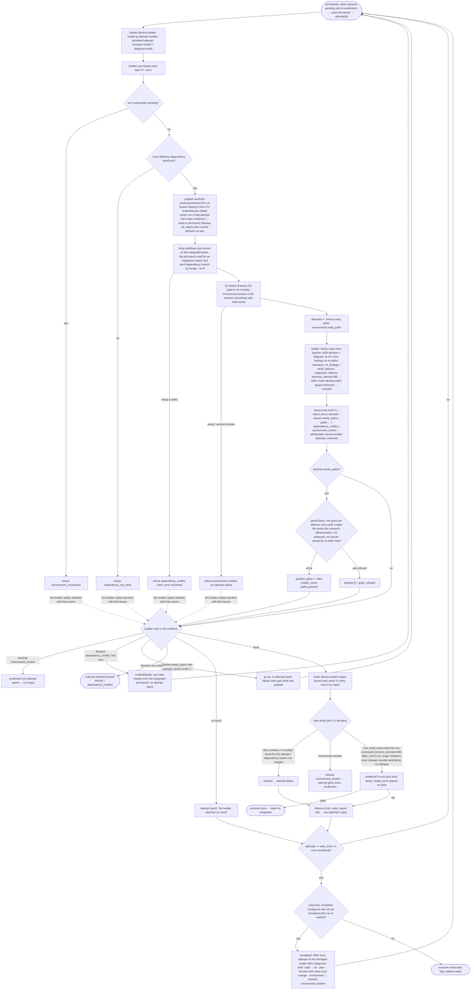
```mermaid
flowchart TD
  A0(["runTask(id): while outcome pending and no envBroken → pass the barrier → attempt(id)"]) --> B["builder (factory:builder, model by attempt number; escalated attempt: strongest model + diagnosis brief)"]
  B --> TS["builder runs factory task start Tn --job J"]
  TS --> TS1{"env routerAction pending?"}
  TS1 -->|"yes"| TSE1["refuse environment_unchecked"]
  TS1 -->|"no"| TS2{"every effective dependency taskDone?"}
  TS2 -->|"no"| TSE2["refuse dependency_not_done"]
  TS2 -->|"yes"| TS3["prepare worktree .factory/worktrees/J/Tn on branch factory/J-nnnn-Tn; restartReason (failed earlier run or last attempt had scope violations) → reset to job branch (backup ref, stash) else commit leftovers as wip:"]
  TS3 --> TS4["bring startBase (job branch as last integrated green; the job branch itself for an integration repair) and each dependency branch by merge --no-ff"]
  TS4 -->|"merge conflict"| TSE4["refuse dependency_conflict (start_error recorded)"]
  TS4 --> TS5["fix marker (Factory-Fix trailer in fix rounds); environment.ensure in the worktree (bootstrap task starts bare)"]
  TS5 -->|"setup / services broken"| TSE5["refuse environment_broken (no attempt spent)"]
  TS5 --> TS6["attempts++, history entry, prints environment.shell_prefix"]
  TS6 --> BUILD["builder: factory task show (packet: ADR decision + diagram, its AC rows, findings on its paths, interfaces, fix_findings / verify_failures / integration_failures, previous_attempt diff) → edits inside allowed paths (guard enforces) → commits"]
  BUILD --> TB["factory task built Tn --status done | blocked --reason needs_paths --paths … | dependency_conflict | environment_broken → afterBuilder records builder {attempt, outcome}"]
  TB --> GRQ{"blocked needs_paths?"}
  GRQ -->|"yes"| GRANT{"grantCheck: one grant per attempt; every path a plain file inside the contract's allowed paths, not protected, not secret, owned by no other task?"}
  GRANT -->|"all ok"| GRANTED["granted_paths += files (=path), event paths_granted"]
  GRANT -->|"any refused"| GREF["granted [] + grant_refused"]
  GRQ -->|"no"| BR
  GRANTED & GREF --> BR{"builder reply in the workflow"}
  BR -->|"blocked environment_broken"| EB["envBroken (no attempt spent) → run stops"]
  BR -->|"blocked dependency_conflict, first time"| DC["conflictRebuilt: next start restarts from the integrated job branch; no attempt spent"]
  DC --> A0
  BR -->|"blocked needs_paths with granted, grants under 2"| GOON["go on, no attempt spent; failure note says what was granted"]
  GOON --> A0
  BR -->|"blocked, any other"| BLK(["outcome blocked (needs PATHS / dependency_conflict)"])
  BR -->|"no result"| NR["attempt spent: 'the builder returned no result'"]
  NR --> LIM
  BR -->|"done"| TEST["tester (factory:tester) relays factory task verify Tn (retry once if no reply)"]
  TEST --> TV{"task verify (the CLI decides)"}
  TV -->|"dirty worktree / no builder result for this attempt / dependency branch not merged"| TVR["refused → attempt failure"]
  TV -->|"environment broken"| TVE["refused environment_broken → attempt given back, envBroken"]
  TV -->|"runs verify cmds inside the env (command_timeout_seconds=600, flaky_reruns=1); scope violations (own changes outside taskPaths); no changes"| EVI["evidence/Tn-a-ts.json {tree, pass}; needs_work cleared on pass"]
  EVI -->|"pass"| DONE(["outcome done → waits for integration"])
  EVI -->|"fail"| FAILN["failures (cmd, code, output tail) → next attempt's input"]
  TVR --> FAILN
  FAILN --> LIM{"attempts >= retry_limit (+1 once escalated)?"}
  LIM -->|"no"| A0
  LIM -->|"yes"| EX{"exhaust(): escalation configured and not yet escalated (this run or earlier)?"}
  EX -->|"yes"| ESC["escalated: ONE more attempt on the strongest model with a diagnosis brief: code → fix · plan → blocked with what must change · environment → blocked environment_broken"]
  ESC --> A0
  EX -->|"no"| EXH(["outcome exhausted (last_failures kept)"])
  TSE1 & TSE2 & TSE4 & TSE5 -.->|"the builder replies blocked with that reason"| BR
```

---

## 8. Reconcile, prove, challenge

### 8a. Reconcile and scope drift

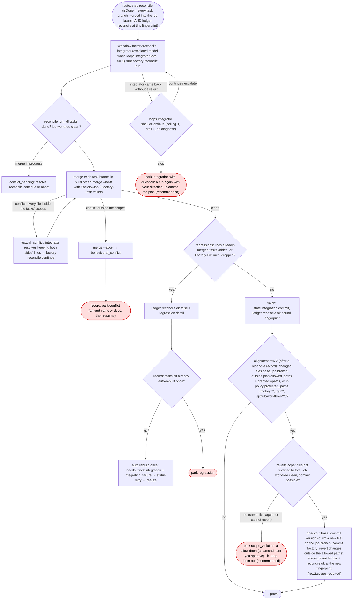
```mermaid
flowchart TD
  IN(["route: step reconcile (isDone = every task branch merged into the job branch AND ledger reconcile at this fingerprint)"]) --> WF["Workflow factory:reconcile: integrator (escalated model when loops.integrator level >= 1) runs factory reconcile run"]
  WF --> RUN{"reconcile.run: all tasks done? job worktree clean?"}
  RUN -->|"merge in progress"| CP["conflict_pending: resolve, reconcile continue or abort"]
  RUN --> MERGE["merge each task branch in build order: merge --no-ff with Factory-Job / Factory-Task trailers"]
  MERGE -->|"conflict, every file inside the tasks' scopes"| TXT["textual_conflict: integrator resolves keeping both sides' lines → factory reconcile continue"]
  TXT --> MERGE
  MERGE -->|"conflict outside the scopes"| ABORT["merge --abort → behavioural_conflict"]
  ABORT --> PC(["record: park conflict (amend paths or deps, then resume)"]):::park
  MERGE -->|"clean"| REG{"regressions: lines already-merged tasks added, or Factory-Fix lines, dropped?"}
  REG -->|"yes"| RL["ledger reconcile ok false + regression detail"]
  RL --> RQ{"record: tasks hit already auto-rebuilt once?"}
  RQ -->|"no"| RB["auto rebuild once: needs_work integration + integration_failure → status retry → realize"]
  RQ -->|"yes"| PR(["park regression"]):::park
  REG -->|"no"| FIN["finish: state.integration.commit, ledger reconcile ok bound fingerprint"]
  WF -->|"integrator came back without a result"| IL{"loops.integrator shouldContinue (ceiling 3, stall 1, no diagnose)"}
  IL -->|"continue / escalate"| WF
  IL -->|"stop"| PI(["park integration with question: a run again with your direction · b amend the plan (recommended)"]):::park
  FIN --> AL{"alignment row 2 (after a reconcile record): changed files base..job branch outside plan allowed_paths + granted =paths, or in policy.protected_paths (.factory/**, .git/**, .github/workflows/**)?"}
  AL -->|"no"| PROVE(["→ prove"])
  AL -->|"yes"| RV{"revertScope: files not reverted before, job worktree clean, commit possible?"}
  RV -->|"yes"| RVC["checkout base_commit version (or rm a new file) on the job branch, commit 'factory: revert changes outside the allowed paths', scope_revert ledger + reconcile ok at the new fingerprint (row2.scope_reverted)"]
  RVC --> PROVE
  RV -->|"no (same files again, or cannot revert)"| PSV(["park scope_violation: a allow them (an amendment you approve) · b keep them out (recommended)"]):::park

  classDef park fill:#fdd,stroke:#c00,color:#000
```

### 8b. Prove (AC evidence, human confirmation)

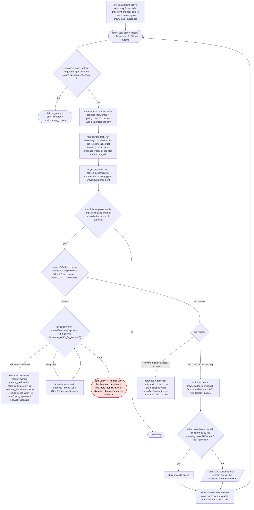
```mermaid
flowchart TD
  IN(["route: step prove: factory verify run --job J (CLI, no agent)"]) --> PRE{"reconcile done for this fingerprint? job worktree clean? environment.ensure ok?"}
  PRE -->|"no"| FAIL(["fail not_ready / dirty_worktree / environment_broken"])
  PRE -->|"yes"| RUNC["run every task verify cmd + contract verify cmds + policy.checks in the job worktree, inside the env"]
  RUNC --> MAP["map to ACs: test / run (covering commands), doc / diff (evidence records), human (confirm AC-n evidence whose scope files are unchanged)"]
  MAP --> LED["ledger prove {ok, acs: proven/failed/missing, commands, missing types, why} bound fingerprint"]
  LED --> AL{"row 5: latest prove at this fingerprint failed and not already the source of state.fix?"}
  AL -->|"no"| NEXT(["→ challenge"])
  AL -->|"yes"| OWN{"ownersOfFailures: tasks owning a failing cmd or a failed AC; an unowned failing cmd → every task"}
  OWN -->|"owners"| VL{"loopStep verify: shouldContinue(keys ac or cmd; ceiling limits.max_verify_fix_rounds=5)"}
  VL -->|"continue / escalate"| VF["verify_fix_rounds++, reopen owners (needs_work verify), state.fix {kind verifyFix, escalate_model, approach} → realize scope verifyFix (row5.acs_unproven / loop.verify.escalate)"]
  VL -->|"diagnose"| DG["fanout-judge --config diagnose --mode verify (God Eye) → recDiagnose"]
  DG --> VL
  VL -->|"stop"| PV(["park verify_fix_rounds with the diagnosis question: a one more round with your direction · b amendment · c cancel job"]):::park
  OWN -->|"no owners"| GAPS{"proveGaps"}
  GAPS -->|"doc / diff record missing"| EV["action evidence (row5.evidence_missing): factory evidence add AC --type doc|diff --path …"]
  EV --> DRV{"drive: exactly one doc/diff file changed by the covering tasks AND the AC text names it?"}
  DRV -->|"yes"| AUTO["drive records it itself"]
  DRV -->|"no"| HAND[/"drive stop evidence: main session checks the worktree and runs the line"/]
  AUTO & HAND --> RER["all recorded since the failed prove → prove runs again (row5.evidence_recorded)"]
  RER --> IN
  GAPS -->|"only the human's check missing"| HUM["deferred: orderAction continues in recipe order (prove skipped while humanAcsPending); asked once in the ship review"]
  HUM --> NEXT
  STALE["row 6: a passing prove exists only for an older fingerprint and reconcile is done → prove again (row6.stale_evidence)"] --> IN

  classDef park fill:#fdd,stroke:#c00,color:#000
```

### 8c. Challenge (review lanes, finding-verifier, unverified carry, fix rounds)

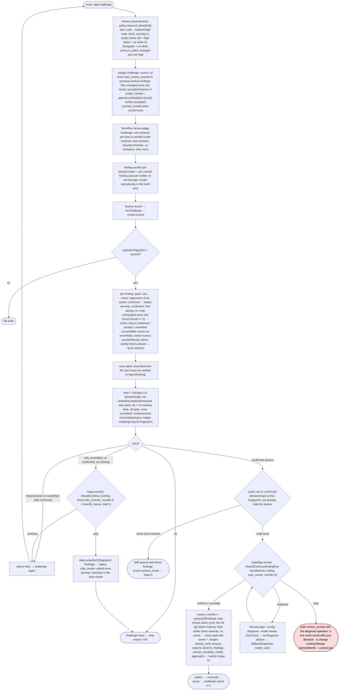
```mermaid
flowchart TD
  IN(["route: step challenge"]) --> LANES["review.requiredLanes: policy.required_lanes[risk] (low code · medium/high code, tests, security) ∪ recipe lanes (all = high lanes + ux when UI changed); + ux when policy.ui_paths changed and risk high"]
  LANES --> BRIEF["wfargs challenge: round n of limits.max_review_rounds=5, previous serious findings, files changed since last round, accepted lessons in scope; carried = openUnverified(last record); verifier escalated (carried_model) when carried exist"]
  BRIEF --> FAN["Workflow fanout-judge challenge: one reviewer per lane in parallel (code-reviewer, test-reviewer, security-reviewer, ux-reviewer), retry once"]
  FAN --> VER["finding-verifier per blocker/major + per carried finding (second verifier on the stronger model reproducing in the build env)"]
  VER --> REC["factory record → recChallenge → review.record"]
  REC --> STAL{"payload fingerprint = current?"}
  STAL -->|"no"| STF(["fail stale"])
  STAL -->|"yes"| CLS["per finding: pack: rule → minor; regression of an earlier confirmed → keeps severity, confirmed; new serious on code unchanged since last round (round >= 2) → minor; status confirmed / refuted / unverified (unverifiable counts as unverified); earlier human accept/dismiss sticks; verifier level contract → level contract"]
  CLS --> CARRY["carry open unverified from the last round (re-verified or kept blocking)"]
  CARRY --> LV["lane = changes if a blocker/major not refuted/accepted/dismissed, else pass; ok = no missing lane, all pass, none unverified; reviews/round-n/scoreboard.json; ledger challenge bound fingerprint"]
  LV --> RES{"result"}
  RES -->|"ok"| OK(["challenge done → ship review / HS"])
  RES -->|"missing lanes or unverified with confirmed"| RETRY["status retry → challenge again"]
  RETRY --> IN
  RES -->|"only unverified, no confirmed, no missing"| RVL{"loops.reverify shouldContinue (ceiling limits.max_reverify_rounds=3 + reverify_bonus, stall 1)"}
  RVL -->|"continue"| RETRY
  RVL -->|"stop"| UNS["state.unsettled {fingerprint, findings} → status ship_review: asked once (accept / dismiss) in the ship review"]
  UNS --> OK
  RES -->|"confirmed serious"| ROW4{"router row 4: confirmed blocker/major at this fingerprint, not already state.fix.source"}
  ROW4 -->|"some level contract"| AM(["skill amend with those findings (row4.contract_level) → Gate A"])
  ROW4 -->|"code level"| RL{"loopStep review: shouldContinue(findingKey lane/file/rule; ceiling max_review_rounds=5)"}
  RL -->|"continue / escalate"| FX["review_rounds++, ownersOfFindings: task whose paths cover the file (git blame Factory-Task trailer when several), no owner → every task with owner *; reopen (needs_work review); state.fix {kind fix, findings, owners, escalate_model, approach} → realize scope fix"]
  FX --> RZ(["realize → reconcile → prove → challenge round n+1"])
  RL -->|"diagnose"| DG["fanout-judge --config diagnose --mode review (God Eye) → recDiagnose (failure → fallbackDiagnosis needs_user)"]
  DG --> RL
  RL -->|"stop"| PRR(["park review_rounds with the diagnosis question: a one more round with your direction · b change contract/design (amendment) · c cancel job"]):::park

  classDef park fill:#fdd,stroke:#c00,color:#000
```

---

## 9. Ship review, HS, ship, merge, CI, distill, close

```mermaid
flowchart TD
  IN(["orderAction reaches HS or ship"]) --> RV["review = {acs: humanAcsPending (prove lacks only human checks), findings: unsettled (challengeAwaitsHuman), push: pushNeeded, hs: step is HS}"]
  RV --> PN{"pushNeeded: risk not high AND not isLocalShip AND policy ship.auto_pr not draft AND no ship_approval for this fingerprint AND gh ready (origin, gh installed, authenticated)"}
  PN --> STEP{"step"}
  STEP -->|"HS (full, hotfix; isDone when isLocalShip)"| HSG{{"Gate HS: hash = build fingerprint, docs report.md; reason = ship review text (rule ship.review_hs)"}}
  STEP -->|"ship, with acs / findings / push"| SRW[/"wait ship_review (rule ship.review): one reply, parts separated by ;"/]
  STEP -->|"ship, nothing for the human"| DQ
  SRW --> PARTS["confirm AC-n → human.confirmAc → evidence human (scope files) · accept|dismiss finding ID WHY → review.settle (ledger finding + re-recorded challenge) · approve ship → state.ship_approval {fingerprint}"]
  HSG -->|"approve (plus the same parts)"| DQ
  HSG -->|"deny REASON"| DS["deniedShip: finding human-1 (major) = your words, every task reopened (owner *), state.fix kind fix → realize → prove → challenge → HS shown on the new build"]
  PARTS --> RR(["factory next: prove re-runs once the human evidence is recorded (row5.evidence_recorded), then ship"])
  RR --> IN
  DQ{"policy drive.stop_before_ship=false?"}
  DQ -->|"true"| STOPS[/"drive stop ship: factory report, the user says ship it"/]
  DQ -->|"false"| SHIP["drive runs factory ship (a long step: fresh drive)"]
  STOPS --> SHIP
  SHIP --> F1{"floors.evaluate before_ship ok?"}
  F1 -->|"no"| FF(["fail floor: missing list"])
  F1 -->|"yes"| F2{"changed files over limits.max_ship_files=200 and no waiver ship_size?"}
  F2 -->|"yes"| FS(["fail size: split, or waive ship_size REASON"])
  F2 -->|"no"| MAN["report.md, doc index, .factory-ship/J.json manifest commit on the job branch"]
  MAN --> LQ{"isLocalShip: policy ship.mode local (default auto) or no origin remote?"}
  LQ -->|"yes"| LOC["pr = {mode local, fingerprint, head}"]
  LQ -->|"no"| GH{"ghReady?"}
  GH -->|"no"| LOC
  GH -->|"yes"| APQ{"risk high: HS approved for this fingerprint? low/medium: ship_approval, else auto_pr draft → forced draft"}
  APQ -->|"neither"| NSA(["fail needs_ship_approval: nothing pushed"])
  APQ -->|"yes"| PUSH["git push -u origin factory/J-nnnn; gh pr create (--draft when forced / opted in) or reuse the open PR"]
  PUSH --> GHPR["pr = {mode github, url, fingerprint, head, draft}"]
  LOC & GHPR --> LS["ledger ship ok bound fingerprint"]
  LS --> H4{"H4 (run merge): isDone = pr.merged"}
  H4 -->|"github, not just synced"| SYNC["cli factory pr sync: checks, review decision, MERGED + mergeCommit → pr.merged (merged_via github)"]
  SYNC --> H4
  H4 -->|"github, just synced, still open"| WGH[/"wait: merge it on GitHub (draft: mark ready); no reply needed"/]
  H4 -->|"local"| DLM{"detectLocalMerge: base branch contains the shipped head?"}
  DLM -->|"yes"| WSEEN[/"wait merge_seen: reply merged to record it as your merge (never recorded from sight)"/]
  DLM -->|"no"| WMERGE[/"wait: git checkout BASE and git merge --no-ff factory/J-nnnn, then reply merged"/]
  WSEEN & WMERGE -->|"merged [commit] (human: contains the head, is on base, no open unverified finding)"| MREC["pr.merged, merge_commit, merged_via"]
  MREC --> CIQ{"later step and floor ci_reverify failing on a local merge?"}
  CIQ -->|"yes"| CIV["factory ci verify --job J (order.ci_reverify, counts toward the repeat guard): re-run the checks on the merge commit in a scratch worktree with the env → checks factory-gate success"]
  CIQ -->|"no / github (CI job factory-gate on the PR, read by pr sync) / waive ci_reverify REASON"| PMQ
  CIV --> PMQ{"hotfix@high: post_merge_challenge"}
  PMQ -->|"yes"| PMC["challenge --mode post_merge, lanes code + security on the merge diff"]
  PMC -->|"confirmed serious"| FU["lifecycle.followup → new follow-up job; this job still closes"]
  PMC -->|"incomplete"| PMC
  PMQ -->|"no"| DIST
  FU --> DIST
  PMC -->|"passed"| DIST
  DIST["distill (skill): drive runs factory distill context"] --> WL{"worth_learning: confirmed findings, verify-fix rounds, recurring minor findings across jobs, build trouble (parks, retries, scope reverts, env breaks, rebuilds…)"}
  WL -->|"yes"| AG[/"drive stop agent: main session starts factory:lesson-writer with the context"/]
  AG --> LW["lesson-writer: factory lessons add --job J --text --scope --why (at most lessons_max_per_job=3) + optional project_brief edits; final message saved to .factory/scratch/lessons.json"]
  LW --> DD["factory drive --lessons file → factory distill done --result: reply checked (schema, ids recorded by this job), brief edits → proposal Pn"]
  WL -->|"no"| DD0["factory distill done (no agent)"]
  DD & DD0 --> DL["ledger distill ok; project-brief.refresh"]
  DL --> CLOSE["factory close: floors full ok? every recipe step but close isDone?"]
  CLOSE -->|"no"| CF(["fail floor (hint: factory ci verify or waive ci_reverify) / not_ready"])
  CLOSE -->|"yes"| CLN["cleanup: env teardown per worktree, worktrees + task branches removed, deps cache removed, services down; status closed"]
  CLN --> PAR{"parent epic?"}
  PAR -->|"yes"| UP["factory use PARENT: back to the epic (drive continues there)"]
  PAR -->|"no"| DONE(["drive stop done: digest.reply e.g. accept lesson L4; accept brief P1 (reject lesson Ln WHY / reject brief Pn WHY)"])
  DONE --> DIG["human-only: lessons.decide / project-brief.decide (accepted brief text reaches every later agent brief)"]
```

---

## 10. Loop engine and the park / resume / answer protocol

### 10a. `loop.shouldContinue` (shared by clarify writer, design critique, review-fix, verify-fix, re-verify, integrator, probe, plan critique, env repair)

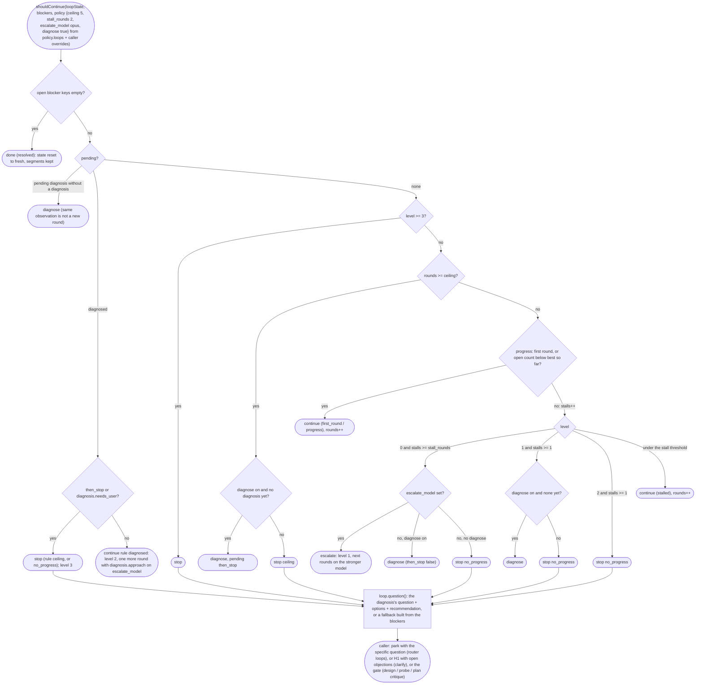
```mermaid
flowchart TD
  C(["shouldContinue(loopState, blockers, policy {ceiling 5, stall_rounds 2, escalate_model opus, diagnose true} from policy.loops + caller overrides)"]) --> E{"open blocker keys empty?"}
  E -->|"yes"| DONE(["done (resolved): state reset to fresh, segments kept"])
  E -->|"no"| P{"pending?"}
  P -->|"pending diagnosis without a diagnosis"| DG(["diagnose (same observation is not a new round)"])
  P -->|"diagnosed"| PD{"then_stop or diagnosis.needs_user?"}
  PD -->|"yes"| STOP1(["stop (rule ceiling, or no_progress); level 3"])
  PD -->|"no"| APPR(["continue rule diagnosed: level 2, one more round with diagnosis.approach on escalate_model"])
  P -->|"none"| L3{"level >= 3?"}
  L3 -->|"yes"| STOP2(["stop"])
  L3 -->|"no"| CE{"rounds >= ceiling?"}
  CE -->|"yes"| STOPF{"diagnose on and no diagnosis yet?"}
  STOPF -->|"yes"| DG2(["diagnose, pending then_stop"])
  STOPF -->|"no"| STOP3(["stop ceiling"])
  CE -->|"no"| PR{"progress: first round, or open count below best so far?"}
  PR -->|"yes"| CONT(["continue (first_round / progress), rounds++"])
  PR -->|"no: stalls++"| LV{"level"}
  LV -->|"0 and stalls >= stall_rounds"| ESCQ{"escalate_model set?"}
  ESCQ -->|"yes"| ESC(["escalate: level 1, next rounds on the stronger model"])
  ESCQ -->|"no, diagnose on"| DG3(["diagnose (then_stop false)"])
  ESCQ -->|"no, no diagnose"| STOP4(["stop no_progress"])
  LV -->|"1 and stalls >= 1"| L1{"diagnose on and none yet?"}
  L1 -->|"yes"| DG4(["diagnose"])
  L1 -->|"no"| STOP5(["stop no_progress"])
  LV -->|"2 and stalls >= 1"| STOP6(["stop no_progress"])
  LV -->|"under the stall threshold"| CONT2(["continue (stalled), rounds++"])
  STOP1 & STOP2 & STOP3 & STOP4 & STOP5 & STOP6 --> Q["loop.question(): the diagnosis's question + options + recommendation, or a fallback built from the blockers"]
  Q --> ASK(["caller: park with the specific question (router loops), or H1 with open objections (clarify), or the gate (design / probe / plan critique)"])
```

### 10b. Parks: kinds, origin, and replies

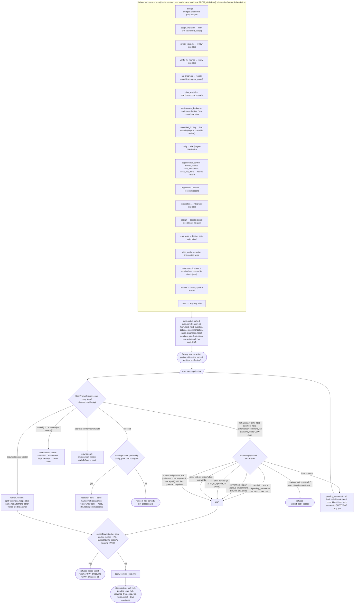
```mermaid
flowchart TD
  subgraph SOURCES["Where parks come from (decision-table.park, kind = extra.kind, else FROM_KIND[from], else realize/reconcile heuristics)"]
    K1["budget ← budgets.exceeded (cap.budget)"]
    K2["scope_violation ← from drift (row2.drift_scope)"]
    K3["review_rounds ← review loop stop"]
    K4["verify_fix_rounds ← verify loop stop"]
    K5["no_progress ← repeat guard (cap.repeat_guard)"]
    K6["plan_invalid ← cap.decompose_rounds"]
    K7["environment_broken ← realize env broken / env repair loop stop"]
    K8["unverified_finding ← from reverify (legacy; now ship review)"]
    K9["clarify ← clarify agent failed twice"]
    K10["dependency_conflict / needs_paths / task_exhausted / tasks_not_done ← realize record"]
    K11["regression / conflict ← reconcile record"]
    K12["integration ← integrator loop stop"]
    K13["design ← decide record (doc streak, no gate)"]
    K14["epic_gate ← factory epic gate failed"]
    K15["plan_probe ← probe interrupted twice"]
    K16["environment_repair ← repaired env passed its check (seal)"]
    K17["manual ← factory park --reason"]
    K18["other ← anything else"]
  end
  SOURCES --> PARK["state.status parked, state.park {reason, at, from, kind, next, question, options, recommendation, cause, diagnosed, loop}, pending_gate P, decision row action park rule park.KIND"]
  PARK --> RT(["factory next → action parked; drive stop parked (desktop notification)"])
  RT --> MSG[/"user message in chat"/]
  MSG --> HOOK{"UserPromptSubmit: exact reply form? (human.readReply)"}
  HOOK -->|"resume [step or words]"| RES["human.resume: splitResume: a recipe step name restarts there, other words are the answer"]
  HOOK -->|"proceed"| PROC{"clarify.proceed: parked by clarify, park kind not agent?"}
  PROC -->|"yes"| PRC["research park → items marked not researched, route; writer park → ready (H1 lists open objections)"]
  PROC -->|"no"| PRF(["refused: not_parked / not_proceedable"])
  HOOK -->|"cancel job / abandon job [reason]"| STOPJ["human.stop: status cancelled / abandoned, deps cleanup → router done"]
  HOOK -->|"approve environment HASH"| SEALP["only for park environment_repair: replyToPark → seal"]
  HOOK -->|"not an exact form, not a question, not a factory/slash command, no blank line, under 2000 chars"| PA{"human.replyToPark → parkAnswer"}
  PA -->|"yes / ok / do it… and a stored pending_answer for THIS park, under 24h"| ANS
  PA -->|"environment_repair: approve environment SHORT, or a alone"| ANS
  PA -->|"environment_repair: ok / yes / 1 / option text / seal…"| SREF(["refused explicit_seal_needed"])
  PA -->|"option letter or number (a, 2, (b), b), option b, b: words)"| ANS
  PA -->|"starts with an option's first two words"| ANS
  PA -->|"shares a significant word (4+ letters, not a stop word, not a path) with the question or options"| ANS
  PA -->|"none of these"| PEND["pending_answer stored; hook tells Claude to ask once: Use this as your answer to QUESTION? reply yes"]
  PEND --> MSG
  ANS --> GRQ{"needsGrant: budget park and no explicit +N% / budget N / the option's (resume +N%)?"}
  RES --> GRQ
  GRQ -->|"yes"| GRF(["refused needs_grant: resume +50% or resume +100% or cancel job"])
  GRQ -->|"no"| AR["applyResume (see 10c)"]
  AR --> ACT(["status active, park null, pending_gate null, resumed {from, step, via, words, grant}; drive continues"])
```

### 10c. `human.applyResume` — what un-parking does per kind

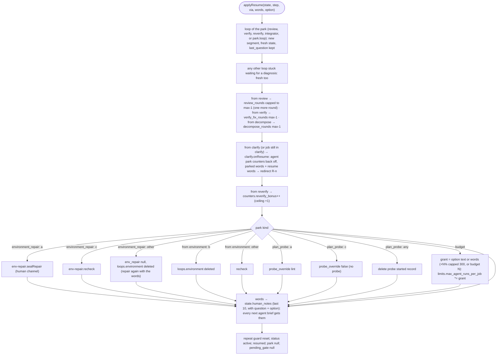
```mermaid
flowchart TD
  A(["applyResume(state, step, via, words, option)"]) --> L1["loop of the park (review, verify, reverify, integrator, or park.loop): new segment, fresh state, last_question kept"]
  L1 --> L2["any other loop stuck waiting for a diagnosis: fresh too"]
  L2 --> C1["from review → review_rounds capped to max-1 (one more round) · from verify → verify_fix_rounds max-1 · from decompose → decompose_rounds max-1"]
  C1 --> C2["from clarify (or job still in clarify) → clarify.onResume: agent park counters back off, parked words + resume words → redirect R-n"]
  C2 --> C3["from reverify → counters.reverify_bonus++ (ceiling +1)"]
  C3 --> C4{"park kind"}
  C4 -->|"environment_repair: a"| E1["env-repair.sealRepair (human channel)"]
  C4 -->|"environment_repair: c"| E2["env-repair.recheck"]
  C4 -->|"environment_repair: other"| E3["env_repair null, loops.environment deleted (repair again with the words)"]
  C4 -->|"from environment: b"| E4["loops.environment deleted"]
  C4 -->|"from environment: other"| E5["recheck"]
  C4 -->|"plan_probe: a"| P1["probe_override lint"]
  C4 -->|"plan_probe: c"| P2["probe_override false (no probe)"]
  C4 -->|"plan_probe: any"| P3["delete probe started record"]
  C4 -->|"budget"| B1["grant = option text or words (+N% capped 300, or budget N): limits.max_agent_runs_per_job *= grant"]
  E1 & E2 & E3 & E4 & E5 & P1 & P2 & P3 & B1 & C4 --> W["words → state.human_notes (last 10, with question + option): every next agent brief gets them"]
  W --> R["repeat guard reset; status active; resumed; park null; pending_gate null"]
```

---

## 11. Drive, hooks, human channels

### 11a. `factory drive` (one typed stop per call)

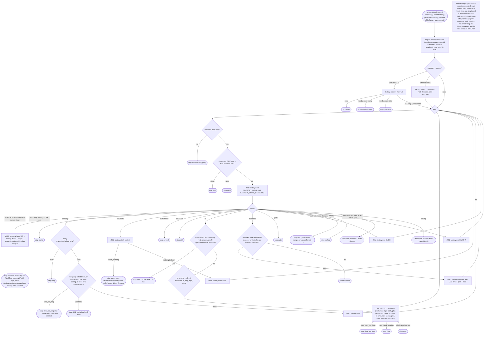
```mermaid
flowchart TD
  D(["factory drive [--record envelope] [--lessons reply] (main session only; refused while factory agents work)"]) --> ACQ["acquire .factory/drive.json (one live drive per repo: pid + start time + host + heartbeat; stale after 30 min)"]
  ACQ --> RECQ{"--record / --lessons?"}
  RECQ -->|"--record FILE"| RE["factory record --file FILE"]
  RE -->|"error"| SE(["stop error"])
  RE -->|"needs_user, clarify"| SC(["stop clarify (screen)"])
  RE -->|"needs_user, other"| SQ(["stop questions"])
  RE -->|"ok / retry / park / stale"| LOOP
  RECQ -->|"--lessons FILE"| LE["factory distill done --result FILE (lessons, brief proposal)"]
  LE --> LOOP
  RECQ -->|"none"| LOOP
  LOOP{"loop"} --> OWN{"still owns drive.json?"}
  OWN -->|"no"| SUP(["stop superseded (quiet)"])
  OWN -->|"yes"| LIM{"steps over 200 / over --max-seconds 480?"}
  LIM -->|"steps"| SL(["stop limit"])
  LIM -->|"time"| SY(["stop yield"])
  LIM -->|"no"| NX["child: factory next (FACTORY_DRIVE=pid, FACTORY_DRIVE_DEADLINE)"]
  NX --> ACT{"action"}
  ACT -->|"workflow, or skill clarify that runs a stage"| WA["child: factory wfargs WF --config --mode --scope --lanes --threat-model --plan-critique"]
  WA --> SW(["stop workflow (hand-off): run Workflow factory:WF with args, save .factory/scratch/envelope.json, factory drive --record"])
  ACT -->|"skill clarify waiting for the user"| SC2(["stop clarify"])
  ACT -->|"skill ship"| SHQ{"policy drive.stop_before_ship?"}
  SHQ -->|"true"| SS(["stop ship"])
  SHQ -->|"false"| LONG1{"longStep: killed twice, or took 85% of the Bash ceiling, or over 30 s already used?"}
  LONG1 -->|"step_too_long"| STL(["stop step_too_long: run COMMAND in your own terminal"])
  LONG1 -->|"used time"| SY2(["stop yield: starts in a fresh drive"])
  LONG1 -->|"fresh"| SHIP["child: factory ship"]
  SHIP --> LOOP
  ACT -->|"skill distill"| DC["child: factory distill context"]
  DC -->|"worth_learning"| SA(["stop agent: start factory:lesson-writer, save reply, factory drive --lessons"])
  DC -->|"nothing to learn"| DDN["child: factory distill done"]
  DDN --> LOOP
  ACT -->|"skill amend"| SAM(["stop amend"])
  ACT -->|"other skill"| SSK(["stop skill"])
  ACT -->|"cli"| CQ{"command is a human-only verb, answer, clarify reply/redirect/note, or drive?"}
  CQ -->|"yes"| SE2(["stop error: not the drive's to run"])
  CQ -->|"no"| LONG2{"long verb: verify, ci, reconcile, pr, ship, epic, close"}
  LONG2 --> RUN["child: factory COMMAND (verify run, deps fetch, plan probe, env check, ci verify, pr sync, epic spawn/gate, close, plan from-contract)"]
  RUN -->|"code step_too_long"| STL2(["stop step_too_long"])
  RUN -->|"env check pending"| SY3(["stop yield"])
  RUN -->|"failed twice in a row"| SE3(["stop error"])
  RUN -->|"ok"| LOOP
  ACT -->|"evidence"| EVQ{"every AC: one doc/diff file changed by its tasks and named by the AC?"}
  EVQ -->|"yes"| EVA["child: factory evidence add AC --type --path --note"]
  EVA --> LOOP
  EVQ -->|"no"| SEV(["stop evidence"])
  ACT -->|"gate"| SG(["stop gate"])
  ACT -->|"wait with ready slice jobs"| USE["child: factory use SLICE"]
  USE --> LOOP
  ACT -->|"wait"| SWT(["stop wait (ship review, merge, env.unconfirmed, …)"])
  ACT -->|"parked"| SP(["stop parked"])
  ACT -->|"done, job is a slice of an active epic"| UP["child: factory use PARENT"]
  UP --> LOOP
  ACT -->|"done"| SD(["stop done (lessons + briefs digest)"])
  ACT -->|"driving"| SE4(["stop error: another drive runs this job"])
  NOTE["Human stops (gate, clarify, questions, parked, wait, amend, ship, done, error, limit, step_too_long) send a desktop notification (policy notify=true); hand-offs (workflow, agent, evidence, skill, yield) do not. Every stop is a drive_stop event and the last is kept in drive.json."]
```

### 11b. Hooks and who may run what

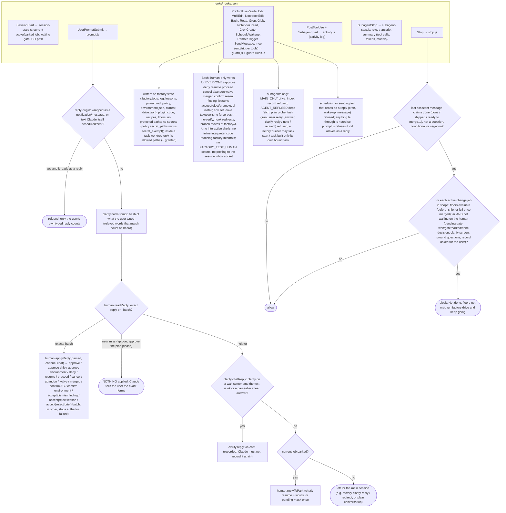
```mermaid
flowchart TD
  subgraph HOOKS["hooks/hooks.json"]
    SSH["SessionStart → session-start.js: current active/parked job, waiting gate, CLI path"]
    UPS["UserPromptSubmit → prompt.js"]
    PTU["PreToolUse (Write, Edit, MultiEdit, NotebookEdit, Bash, Read, Grep, Glob, NotebookRead, CronCreate, ScheduleWakeup, RemoteTrigger, SendMessage, mcp send/trigger tools) → guard.js + guard-rules.js"]
    POS["PostToolUse + SubagentStart → activity.js (activity log)"]
    SST["SubagentStop → subagent-stop.js: role, transcript summary (tool calls, tokens, models)"]
    STH["Stop → stop.js"]
  end
  UPS --> O1{"reply-origin: wrapped as a notification/message, or text Claude itself scheduled/sent?"}
  O1 -->|"yes and it reads as a reply"| O1R(["refused: only the user's own typed reply counts"])
  O1 -->|"no"| O2["clarify.notePrompt: hash of what the user typed (relayed words that match count as heard)"]
  O2 --> O3{"human.readReply: exact reply or ; batch?"}
  O3 -->|"exact / batch"| O3A["human.applyReply(parsed, channel chat) → approve / approve ship / approve environment / deny / resume / proceed / cancel / abandon / waive / merged / confirm AC / confirm environment / accept|dismiss finding / accept|reject lesson / accept|reject brief (batch: in order, stops at the first failure)"]
  O3 -->|"near miss (aprove, approve the plan please)"| O3N(["NOTHING applied: Claude tells the user the exact forms"])
  O3 -->|"neither"| O4{"clarify.chatReply: clarify on a wait screen and the text is ok or a parseable sheet answer?"}
  O4 -->|"yes"| O4A["clarify.reply via chat (recorded; Claude must not record it again)"]
  O4 -->|"no"| O5{"current job parked?"}
  O5 -->|"yes"| O5A["human.replyToPark (chat): resume + words, or pending + ask once"]
  O5 -->|"no"| O6(["left for the main session (e.g. factory clarify reply / redirect, or plain conversation)"])

  PTU --> G1["writes: no factory state (.factory/jobs, log, lessons, project.md, policy, environment.json, current, drive.json), plugin code, recipes, floors; no protected paths; no secrets (policy.secret_paths minus secret_exempt); inside a task worktree only its allowed paths (+ granted)"]
  PTU --> G2["Bash: human-only verbs for EVERYONE (approve deny resume proceed cancel abandon waive merged confirm reseal finding; lessons accept/reject/promote; ci install; env set; drive takeover); no force-push, --no-verify, hook redirects, branch moves of factory/J-*; no interactive shells; no inline interpreter code reaching factory internals; no FACTORY_TEST_HUMAN seams; no posting to the session inbox socket"]
  PTU --> G3["subagents only: MAIN_ONLY drive, inbox, record refused; AGENT_REFUSED deps fetch, plan probe, task grant; user relay (answer, clarify reply / note / redirect) refused; a factory:builder may task start / task built only its own bound task"]
  PTU --> G4["scheduling or sending text that reads as a reply (cron, wake-up, message) refused; anything let through is noted so prompt.js refuses it if it arrives as a reply"]
  STH --> S1{"last assistant message claims done (done / shipped / ready to merge…), not a question, conditional or negation?"}
  S1 -->|"no"| S0(["allow"])
  S1 -->|"yes"| S2{"for each active change job in scope: floors.evaluate (before_ship, or full once merged) fail AND not waiting on the human (pending gate, wait/gate/parked/done decision, clarify screen, ground questions, record asked for the user)?"}
  S2 -->|"yes"| SB(["block: Not done, floors not met: run factory drive and keep going"])
  S2 -->|"no"| S0
```

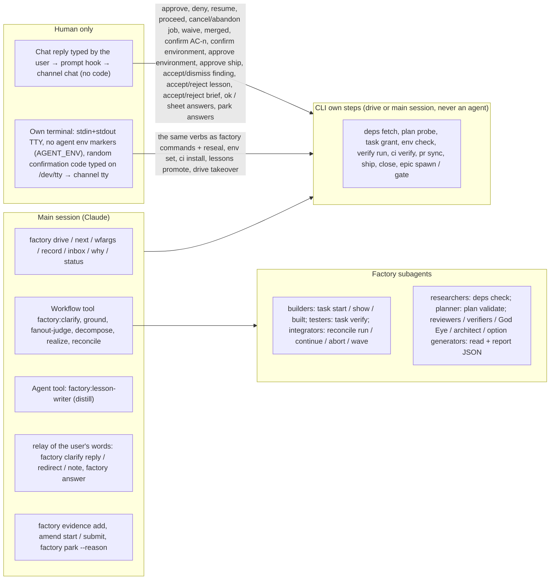
```mermaid
flowchart LR
  subgraph HUMAN["Human only"]
    CH["Chat reply typed by the user → prompt hook → channel chat (no code)"]
    TT["Own terminal: stdin+stdout TTY, no agent env markers (AGENT_ENV), random confirmation code typed on /dev/tty → channel tty"]
  end
  subgraph MAIN["Main session (Claude)"]
    M1["factory drive / next / wfargs / record / inbox / why / status"]
    M2["Workflow tool factory:clarify, ground, fanout-judge, decompose, realize, reconcile"]
    M3["Agent tool: factory:lesson-writer (distill)"]
    M4["relay of the user's words: factory clarify reply / redirect / note, factory answer"]
    M5["factory evidence add, amend start / submit, factory park --reason"]
  end
  subgraph AGENTS["Factory subagents"]
    A1["builders: task start / show / built; testers: task verify; integrators: reconcile run / continue / abort / wave"]
    A2["researchers: deps check; planner: plan validate; reviewers / verifiers / God Eye / architect / option generators: read + report JSON"]
  end
  subgraph CLI["CLI own steps (drive or main session, never an agent)"]
    C1["deps fetch, plan probe, task grant, env check, verify run, ci verify, pr sync, ship, close, epic spawn / gate"]
  end
  CH -->|"approve, deny, resume, proceed, cancel/abandon job, waive, merged, confirm AC-n, confirm environment, approve environment, approve ship, accept/dismiss finding, accept/reject lesson, accept/reject brief, ok / sheet answers, park answers"| CLI
  TT -->|"the same verbs as factory commands + reseal, env set, ci install, lessons promote, drive takeover"| CLI
  MAIN --> CLI
  M2 --> AGENTS
```

---

## 12. Amendment gate A and denial reroutes

```mermaid
flowchart TD
  T1["user: requirements changed"] --> SK
  T2["row 2: contract hash ≠ H1 approval, or plan ≠ H3 plan after building started (row2.drift_contract / drift_plan)"] --> SK
  T3["row 4: verifier confirmed a finding at contract level (row4.contract_level)"] --> SK
  T4["epic amendment touched this slice: state.needs_replan (row2.epic_replan)"] --> SK
  T5["park answers that ask for it: needs_paths, task_exhausted a, dependency_conflict, conflict, scope_violation a, review/verify b, integration b"] --> SK
  SK["skill factory:amend (router action skill amend while an amendment is open)"] --> DRQ{"drift the user did not intend?"}
  DRQ -->|"yes"| RESTORE["restore approved original from jobs/J/approved/ → factory next"]
  DRQ -->|"no"| ST["factory amend start --reason --by (fails if one is open/submitted): A-n dir with before-contract.md / before-plan.json from the APPROVED snapshots; amendment status open"]
  ST --> ED["edit only the affected ACs in contract.md and tasks in plan.json (or slices.json)"]
  ED --> SUB["factory amend submit: contract.problems, plan.validate, diffAcs, affected tasks (changed or citing a changed AC); nothing changed → fail; amendment.json + hash; status submitted"]
  SUB --> GA["route: gate A pending_gate {A, hash, docs amendment.json} (pre-empts a park: resumes_park)"]
  GA --> GAS[/"drive stop gate A"/]
  GAS -->|"approve"| AQ{"contract / plan hash still = the submitted after-hashes?"}
  AQ -->|"no"| AST(["fail stale_gate: amend submit again"])
  AQ -->|"yes"| APP["amend.applyApproved: H1/EH1 rebound to the new contract, H3/EH3 to the new plan (combined: gateHash), records clarify / ground / decide / decompose / plan_critique carried to the new hashes (rebound_by A-n), affected tasks needs_work amendment, epic children needs_replan; status applied"]
  APP --> RP{"job parked and not a budget park?"}
  RP -->|"yes"| AR["applyResume via amendment (one more round of the cap that parked it)"]
  RP -->|"no"| RT
  AR --> RT(["factory next: realize scope amendment rebuilds only the affected tasks"])
  GAS -->|"deny REASON"| AD["amendment status open again → skill amend"]
  AD --> ED

  subgraph DENY["Denials (human.deny: a presented gate, reason required → state.denials {gate, hash, at, reason})"]
    DQ{"deniedReroute(gate): PRODUCER map"}
    DQ -->|"H1 / EH1 → clarify"| D1["clarify reads the words back as redirect R-n, restarts at the earliest affected stage"]
    DQ -->|"H2 / EH2 / HF → decide"| D2["decide again; denyMode targeted (architect revises the denied design, no new options) or rethink (new options)"]
    DQ -->|"H3 combined with design → critics.denyTarget"| D3["rethink or design / api words → decide; plan / task / verify / env words without design words → decompose"]
    DQ -->|"H3 without design / EH3 → decompose"| D4["planner re-plans with the reason"]
    DQ -->|"HS → deniedShip"| D5["finding human-1 (major) = the reason; every task reopened; fix round; HS shown on the new build"]
    DQ -->|"producer missing or cli:, or it already ran since the denial"| D6["the gate is shown again (same or new document)"]
  end
```

---

## 13. Sequence: one standard@medium job

Recipe `standard@medium`: clarify → H1 → deps → ground → decide (threat model only when risk high: not here) → decompose →
H3 (combined design + plan + environment) → realize → reconcile → prove → challenge (code, tests, security) → ship → H4 → distill → close.

```mermaid
sequenceDiagram
  autonumber
  actor U as User
  participant MS as Main session (Claude)
  participant HK as Hooks (prompt / guard / stop)
  participant CLI as factory CLI
  participant DR as factory drive
  participant WF as Workflow tool
  participant AG as Subagents

  U->>MS: /factory:start add CSV export
  MS->>CLI: factory doctor, then intake: factory job new --type feature --risk medium --request ...
  CLI-->>MS: J-0001, recipe standard@medium v2, lock sealed, branch factory/J-0001
  MS->>DR: factory drive
  DR->>CLI: factory next (alignment row1 → clarify, stage readback)
  DR->>CLI: factory wfargs clarify
  DR-->>MS: stop workflow (clarify readback brief)
  MS->>WF: Workflow factory:clarify with args
  WF->>AG: interviewer (read-back)
  AG-->>WF: read-back JSON
  WF-->>MS: envelope
  MS->>DR: factory drive --record envelope.json
  DR->>CLI: factory record (clarify.record → readback shown, auto-confirmed → research)
  DR-->>MS: stop workflow (research)
  MS->>WF: factory:clarify research
  WF->>AG: researcher repo + researcher docs, then brief-writer
  MS->>DR: factory drive --record
  DR-->>MS: stop clarify (decision sheet screen)
  MS-->>U: sheet (as it is)
  U->>HK: 1 a, 2 b
  HK->>CLI: clarify.chatReply (recorded via chat)
  HK-->>MS: Recorded your reply, continue with factory drive
  MS->>DR: factory drive
  DR-->>MS: stop workflow (assemble: contract-writer)
  MS->>WF: factory:clarify assemble
  WF->>AG: contract-writer
  MS->>DR: factory drive --record (deterministic checks)
  DR-->>MS: stop workflow (check: God Eye readiness)
  MS->>WF: factory:clarify check
  WF->>AG: god-eye readiness checklist
  MS->>DR: factory drive --record (stage ready, ledger clarify ok)
  DR->>CLI: factory next → gate H1 (contract hash, h1Summary)
  DR-->>MS: stop gate H1 (notification)
  MS-->>U: contract + what H1 shows
  U->>HK: approve
  HK->>CLI: human.approve(channel chat) → approvals.H1
  MS->>DR: factory drive
  DR->>CLI: factory next → cli factory deps fetch --job J-0001
  DR->>CLI: factory deps fetch (pinned source, read-only)
  DR->>CLI: factory next → workflow ground
  DR-->>MS: stop workflow (ground brief)
  MS->>WF: factory:ground
  WF->>AG: researchers codebase, interfaces (API ledger + deps check), history, external
  MS->>DR: factory drive --record (ledger quotes re-checked, findings.md)
  DR-->>MS: stop workflow (fanout-judge decide)
  MS->>WF: factory:fanout-judge decide
  WF->>AG: option-generator x3 in parallel
  WF->>AG: architect (ADR adr@2)
  WF->>AG: god-eye + api-conformance critics, finding-verifier per serious item
  WF->>AG: architect revise while objections shrink
  MS->>DR: factory drive --record (doc check, critiques/design.json, decide ok)
  DR-->>MS: stop workflow (decompose phase plan)
  MS->>WF: factory:decompose
  WF->>AG: planner (plan.json + environment.proposed.json, plan validate)
  MS->>DR: factory drive --record (valid → probe_pending)
  DR->>CLI: factory next → cli factory plan probe (long step, may yield)
  DR->>CLI: factory plan probe (lint or full dry-run in a scratch worktree)
  DR-->>MS: stop workflow (decompose phase critique)
  MS->>WF: factory:decompose critique
  WF->>AG: god-eye plan critique with the probe record
  MS->>DR: factory drive --record (decompose ok)
  DR->>CLI: factory next → gate H3 combined design + plan + environment
  DR-->>MS: stop gate H3
  MS-->>U: design (decision table, diagrams, layout tree with owners), plan, probe, proposed environment
  U->>HK: approve
  HK->>CLI: human.approve → approvals.H3 {design, plan, environment}, environment.confirm (sealed)
  MS->>DR: factory drive
  DR->>CLI: factory next → env.check: factory env check --job J-0001
  DR->>CLI: factory env check (scratch worktree setup passes)
  DR-->>MS: stop workflow (realize, scope all)
  MS->>WF: factory:realize
  loop each task, by dependency, up to 4 at once
    WF->>AG: builder: task start, task show, edit, commit, task built
    WF->>AG: tester: task verify (CLI evidence decides)
    WF->>AG: integrator: reconcile wave (per frontier)
  end
  MS->>DR: factory drive --record (every task done)
  DR-->>MS: stop workflow (reconcile)
  MS->>WF: factory:reconcile
  WF->>AG: integrator: reconcile run
  MS->>DR: factory drive --record
  DR->>CLI: factory next → cli factory verify run (prove)
  DR->>CLI: factory verify run (AC evidence)
  DR-->>MS: stop workflow (fanout-judge challenge, lanes code tests security)
  MS->>WF: factory:fanout-judge challenge
  WF->>AG: code-reviewer, test-reviewer, security-reviewer, finding-verifier per serious finding
  MS->>DR: factory drive --record (lanes pass)
  DR->>CLI: factory next → ship review (approve ship needed: no draft opt-in)
  DR-->>MS: stop wait ship_review
  MS-->>U: ship review screen
  U->>HK: approve ship
  HK->>CLI: human.approveShip → ship_approval for this fingerprint
  MS->>DR: factory drive
  DR->>CLI: factory ship (floors before_ship, manifest, push, gh pr create)
  DR->>CLI: factory next → cli factory pr sync, then wait
  DR-->>MS: stop wait (merge it on GitHub)
  U->>U: merges the PR on GitHub (CI factory-gate re-verifies)
  MS->>DR: factory drive
  DR->>CLI: factory pr sync (merged) then factory distill context
  DR-->>MS: stop agent (lesson-writer) when worth learning
  MS->>AG: factory:lesson-writer (factory lessons add ...)
  MS->>DR: factory drive --lessons lessons.json
  DR->>CLI: factory distill done, factory close (full floors, cleanup)
  DR-->>MS: stop done with digest reply
  MS-->>U: summary + digest: accept lesson L1, accept brief P1
  MS->>HK: (turn ends) Stop hook: floors met or job closed, allow
```

---

## 14. Recipe matrix

`✓` runs · `—` skipped (not in the recipe) · gates in bold. Lanes are what `review.requiredLanes` computes:
`policy.required_lanes[risk]` ∪ the step's `lanes` (`all` = `required_lanes.high` + `ux` when `policy.ui_paths` changed), plus `ux` at high
risk when UI files changed. Floors are `policy/floors.json` expanded by risk (`epic` and outcome `findings` only require `contract_approved`).

| Step / gate | bug@low | feature@low | standard@medium | full@high | hotfix@high | spike | epic |
|---|---|---|---|---|---|---|---|
| Selected when | risk low + bug/docs/dependency | risk low, other types | risk medium | risk high (incl. migration via risk_floor) | work_type hotfix (risk floored to high) | work_type spike | `--epic` |
| clarify (v3) | ✓ | ✓ | ✓ | ✓ | ✓ | ✓ | ✓ (mode epic) |
| **H1 / EH1** | **H1** | **H1** | **H1** | **H1** | **H1** | **H1** | **EH1** |
| deps (`factory deps fetch`) | — | — | ✓ | ✓ | ✓ | ✓ | — |
| ground | ✓ | ✓ | ✓ | ✓ | ✓ (mode hotfix: failing path, blast radius) | ✓ | ✓ |
| decide (fanout-judge) | — | — | ✓ threat model `policy` (= risk high → off) | ✓ threat model on | ✓ threat model on | ✓ mode recommendation, no threat model, no api-conformance | ✓ mode contracts, threat model `policy` |
| **H2 / EH2 / HF** | — | — | — (design approved inside H3) | **H2** | **H2** | **HF** (then close) | **EH2** |
| decompose | `factory plan from-contract` (1 task, no probe, no critique) | workflow + plan_critique (+probe) | workflow + probe + critique | workflow + probe + critique | workflow + probe + critique | — | workflow mode slices |
| **H3 / EH3** | — (no plan gate; env needs `confirm environment`) | **H3 auto** `plan_critique`, combined plan + environment (skipped when critique approved and env needs no confirmation) | **H3 combined** design + plan + environment | **H3 combined** plan + environment | **H3 combined** plan + environment | — | **EH3** |
| env check / repair | ✓ | ✓ | ✓ | ✓ | ✓ | — | per slice |
| realize | ✓ | ✓ | ✓ | ✓ | ✓ | — | — (children: `factory epic spawn`, slices run their own recipes) |
| reconcile | ✓ | ✓ | ✓ | ✓ | ✓ | — | — |
| prove (`factory verify run`) | ✓ | ✓ | ✓ | ✓ | ✓ | — | — (`epic_gate`: `factory epic gate`) |
| challenge lanes | code | code, tests | code, tests, security | code, tests, security (+ux if UI) | code, tests, security (+ux if UI) | — | conformance (epic-reviewer) |
| **HS** | — | — | — | **HS** (skipped when local ship) | **HS** (skipped when local ship) | — | — |
| ship review (`approve ship`) | when push needed | when push needed | when push needed | — (HS is the approval) | — (HS) | — | — |
| ship | ✓ | ✓ | ✓ | ✓ | ✓ | — | — |
| H4 merge (human) | ✓ | ✓ | ✓ | ✓ | ✓ | — | — |
| post_merge_challenge | — | — | — | — | ✓ code + security | — | — |
| distill | ✓ | ✓ | ✓ | ✓ | ✓ | — | ✓ |
| close | ✓ | ✓ | ✓ | ✓ | ✓ | ✓ | ✓ |
| Floors | low | low | medium | high | high | contract_approved only | contract_approved only |

Floors by risk (`policy/floors.json`):
- **low**: contract_approved, isolation, prove, challenge:code, no_unverified_serious, ci_reverify, human_merge
- **medium**: low + ground, design_record, design_critique, plan_validated, challenge:tests, challenge:security, finding_verifiers
- **high**: medium + threat_model, H2, H3 (not `via policy`), challenge:all_before_merge, no_trial_recipes, irreversible_signoff (HS, or a local ship)
- `after_merge` (skipped by `before_ship`): ci_reverify, human_merge. Waivable: ci_reverify, ship_size.

Gate ids and what they bind (`steps.gateHash`): H1/EH1 = contract · H2/EH2 = design · H3/EH3 = plan, or for a combined H3
sha256({design, plan, environment hash}) · HS = build fingerprint · HF = sha256(findings:design) · A = amendment.json hash ·
P = the park pseudo-gate (not approvable). H4 is not a gate id: it is the recipe's `merge` step (`pr.merged`).

---

## 15. Where the code is ambiguous

1. **Workflow error → "retry once, then park".** `record.apply` returns that message for an envelope with `status: error`, but no
   counter implements it. What actually happens: the error is appended to the ledger (excluded from `repeatKey`'s ledger length), so
   `factory next` picks the same step again; the repeat guard parks `no_progress` once the same decision repeats more than
   `limits.repeat_guard=2` times with attempts in between. So it is "retry twice, then park" in effect. The drive itself stops with
   `error` only when a *CLI* step fails twice in a row.
2. **GitHub-mode CI re-verify.** `localReverify` only routes `factory ci verify` for a local merge. On GitHub the `ci_reverify` floor
   is met only if `factory pr sync` saw the required check (`ci.required_check=factory-gate`) as `success`. If the PR merged with the
   check missing or failing, the router still moves on (H4 is done) and `factory close` fails on the floor; the drive then stops with
   `error` after two failures. No dedicated route or park exists for that case.
3. **standard@medium's `threat_model: "policy"`** means "only at risk high", but this recipe is only selected for risk medium, so it
   never runs a threat model (same for the epic recipe unless the epic is high risk).
4. **feature@low `applies_to`** lists bug/docs/dependency, but `_selection.json` routes those to bug@low first; feature@low only gets
   them if the selection file is edited.
5. **H2 `when: "adr"`** is supported by `steps.isDone` and `recDecide`, but no shipped recipe uses it.
6. **Clarify writer/research parks and `proceed`.** Since 0.9.0 the writer loop never parks (it ends at H1 or on the sheet) and
   research failures become gaps; `parkReplies` for kind `writer` with a rule and `proceed` remain for parks recorded by older versions
   (`legacyWriterPark`). Today the only clarify park is kind `agent`, for which `proceed` is refused.
7. **Park kind `unverified_finding`** (FROM_KIND `reverify`) is still in `PARK_NEXT`/`LOOP_PARKS`, but `recChallenge` now ends the
   re-verify loop in the ship review (`state.unsettled`) instead of parking. Only `applyResume`'s `from === 'reverify'` path remains.
8. **Park `design` without a gate.** `recDecide` parks when the critique did not approve and "no human gate will review it", but every
   shipped recipe with decide has a design gate (H2, combined H3 with design, HF, EH2). In practice only the doc-template streak
   (3 decide runs) produces a `design` park.
9. **bug@low and the environment.** bug@low has no plan gate, so a proposed environment is never sealed by a gate approval; realize
   waits on `env.unconfirmed` until the user replies `confirm environment HASH` (or `none`). The low-risk floors do not require
   `plan_validated`, and `plan from-contract` is not probed or critiqued.
10. **`drive` kind `skill`.** Kept for future recipe steps; no shipped recipe step produces it (ship, distill, amend and clarify have
    their own handling).
11. **Ship review vs `pushNeeded` after a local fallback.** `pushNeeded` checks `ghReady`; if gh later fails at `factory ship`, the job
    ships locally without asking for `approve ship` (local mode pushes nothing). The ship review may therefore have asked for an
    approval that the actual ship does not use.
12. **H3 auto on feature@low with a proposed environment.** `isDone(H3)` skips the gate only when the environment needs no
    confirmation; if one does, the human gate is shown even though the plan critique approved. Approving it seals the environment
    (combined `plan` + `environment`).
13. **Integration "frontier".** The workflow calls the batch's deepest plan wave its "wave" label (`reconcile wave --wave n`), but
    batches are formed by completion order, not by wave; the label is only a record of the frontier.
