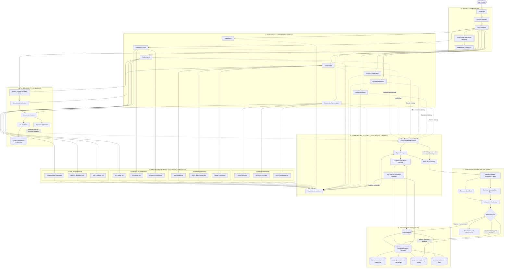

```mermaid
flowchart TB
    USER(["User Request"])

    subgraph ORCHESTRATION["A. FACTORY ORCHESTRATION"]
        direction TB

        ROUTER["Job Router"]
        WORKFLOW["Workflow Manager"]
        SCHEDULER["DAG Scheduler"]
        GATES["Quality Gates and Human Approvals"]
        CLI["Deterministic Factory CLI"]

        ROUTER --> WORKFLOW
        WORKFLOW --> SCHEDULER
        SCHEDULER --> GATES
        GATES --> CLI
    end

    USER --> ROUTER

    subgraph AGENT_LAYER["B. AGENT LAYER — ACCOUNTABLE WORKERS"]
        direction TB

        INTAKE["Intake Agent"]
        ARCH["Architecture Agent"]
        BUILDER["Builder Agent"]
        TESTER["Testing Agent"]
        SECURITY["Security Review Agent"]
        DOCS["Documentation Agent"]
        DEPLOY["Deployment Agent"]
        REVIEW["Independent Review Agent"]

        INTAKE ~~~ ARCH
        ARCH ~~~ BUILDER
        BUILDER ~~~ TESTER
        TESTER ~~~ SECURITY
        SECURITY ~~~ DOCS
        DOCS ~~~ DEPLOY
        DEPLOY ~~~ REVIEW
    end

    SCHEDULER --> INTAKE
    SCHEDULER --> ARCH
    SCHEDULER --> BUILDER
    SCHEDULER --> TESTER
    SCHEDULER --> SECURITY
    SCHEDULER --> DOCS
    SCHEDULER --> DEPLOY
    SCHEDULER --> REVIEW

    subgraph BOT_LAYER["C. AGENT-ASSOCIATED BOTS — FOCUSED SPECIALIST WORK"]
        direction TB

        subgraph BUILDER_BOTS["Builder Bot Assignments"]
            direction TB
            BB1["Implementation Pattern Bot"]
            BB2["Version Compatibility Bot"]
            BB3["Error Diagnosis Bot"]
        end

        subgraph ARCH_BOTS["Architecture Bot Assignments"]
            direction TB
            AB1["API Design Bot"]
            AB2["Data Model Bot"]
            AB3["Integration Analysis Bot"]
        end

        subgraph TEST_BOTS["Testing Bot Assignments"]
            direction TB
            TB1["Test Strategy Bot"]
            TB2["Edge-Case Discovery Bot"]
            TB3["Failure Analysis Bot"]
        end

        subgraph REVIEW_BOTS["Review Bot Assignments"]
            direction TB
            RB1["Code Analysis Bot"]
            RB2["Security Analysis Bot"]
            RB3["Finding Verification Bot"]
        end
    end

    BUILDER --> BB1
    BUILDER --> BB2
    BUILDER --> BB3

    ARCH --> AB1
    ARCH --> AB2
    ARCH --> AB3

    TESTER --> TB1
    TESTER --> TB2
    TESTER --> TB3

    REVIEW --> RB1
    REVIEW --> RB2
    REVIEW --> RB3

    subgraph EXPERT_SYSTEM["D. SHARED EXPERT SYSTEM — CROSS-FACTORY CAPABILITY"]
        direction TB

        ACCESS["Expert Access Interface"]
        MANAGER["Expert Manager"]
        MATCH["Capability and Version Matching"]
        ASSEMBLER["Task-Specific Knowledge Assembly"]
        DISPATCH["Micro Bot Dispatcher"]
        FEEDBACK["Expert Feedback Processor"]

        ACCESS --> MANAGER
        MANAGER --> MATCH
        MATCH --> ASSEMBLER
        MANAGER --> DISPATCH
        FEEDBACK --> MANAGER
    end

    BB1 -.-> ACCESS
    BB2 -.-> ACCESS
    BB3 -.-> ACCESS

    AB1 -.-> ACCESS
    AB2 -.-> ACCESS
    AB3 -.-> ACCESS

    TB1 -.-> ACCESS
    TB2 -.-> ACCESS
    TB3 -.-> ACCESS

    RB1 -.-> ACCESS
    RB2 -.-> ACCESS
    RB3 -.-> ACCESS

    INTAKE -.-> ACCESS
    ARCH -.-> ACCESS
    BUILDER -.-> ACCESS
    TESTER -.-> ACCESS
    SECURITY -.-> ACCESS
    DOCS -.-> ACCESS
    DEPLOY -.-> ACCESS
    REVIEW -.-> ACCESS

    subgraph CATALOG["E. PERSISTENT EXPERT CATALOG"]
        direction TB

        REGISTRY[("Expert Registry")]
        KNOWLEDGE[("Versioned Expertise Packages")]
        SOURCES[("Evidence and Source References")]
        EXAMPLES[("Verified Examples and Procedures")]
        HISTORY[("Verification and Change History")]
        INDEX[("Capability and Version Index")]

        REGISTRY --- KNOWLEDGE
        KNOWLEDGE --- SOURCES
        KNOWLEDGE --- EXAMPLES
        KNOWLEDGE --- HISTORY
        REGISTRY --- INDEX
        KNOWLEDGE --- INDEX
    end

    MATCH <--> REGISTRY
    ASSEMBLER <--> KNOWLEDGE

    subgraph DEVELOPMENT["F. EXPERT DEVELOPMENT AND GOVERNANCE"]
        direction TB

        SPEC["Define Scope and Acceptance Criteria"]
        RESEARCH["Research Micro Bots"]
        SPECIALISTS["Technical Specialist Micro Bots"]
        VALIDATION["Independent Verification"]
        PUBLICATION{"Publication Gate"}
        MAINTENANCE["Revalidation and Maintenance"]

        SPEC --> RESEARCH
        SPEC --> SPECIALISTS
        RESEARCH --> VALIDATION
        SPECIALISTS --> VALIDATION
        VALIDATION --> PUBLICATION
        PUBLICATION --> MAINTENANCE
    end

    DISPATCH --> SPEC

    PUBLICATION -->|"Approved package or revision"| KNOWLEDGE
    PUBLICATION -->|"Register or update expert"| REGISTRY
    PUBLICATION -->|"Record verification evidence"| HISTORY

    KNOWLEDGE --> ASSEMBLER
    ASSEMBLER -->|"Relevant knowledge"| ACCESS

    BUILDER -.->|"Implementation findings"| FEEDBACK
    TESTER -.->|"Test findings"| FEEDBACK
    SECURITY -.->|"Security findings"| FEEDBACK
    DOCS -.->|"Documentation findings"| FEEDBACK
    DEPLOY -.->|"Operational findings"| FEEDBACK
    REVIEW -.->|"Review findings"| FEEDBACK

    FEEDBACK -->|"Verified improvement proposal"| DISPATCH

    subgraph LIFECYCLE["G. FACTORY QUALITY AND LEARNING"]
        direction TB

        IMPLEMENT["Build or Perform Assigned Work"]
        VERIFY["Deterministic Verification"]
        CHALLENGE["Independent Review"]
        DISTILL["Job Distillation"]
        LESSONS[("Factory Lessons and Project Brief")]
        DELIVERABLE["Approved Deliverable"]

        IMPLEMENT --> VERIFY
        VERIFY --> CHALLENGE
        CHALLENGE --> DISTILL
        DISTILL --> LESSONS
        CHALLENGE --> DELIVERABLE
    end

    BUILDER --> IMPLEMENT
    TESTER --> VERIFY
    REVIEW --> CHALLENGE

    DISTILL -.->|"Potential reusable technical expertise"| FEEDBACK

    CLI --> IMPLEMENT
```
